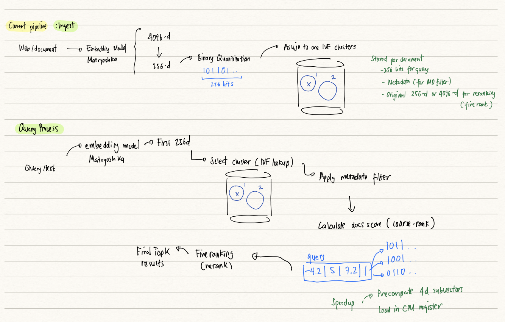
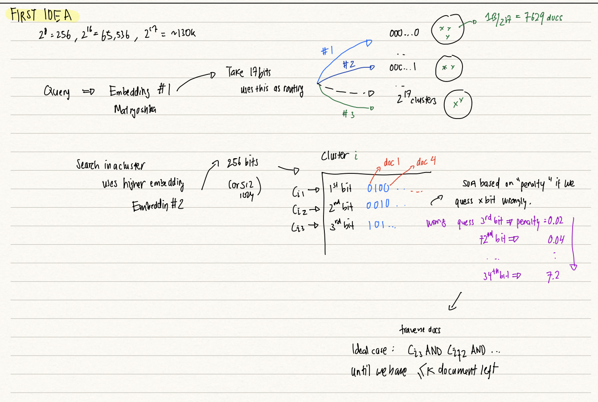
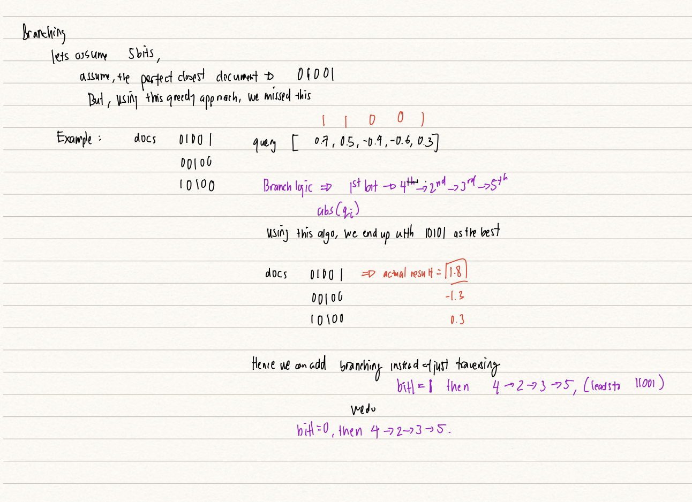
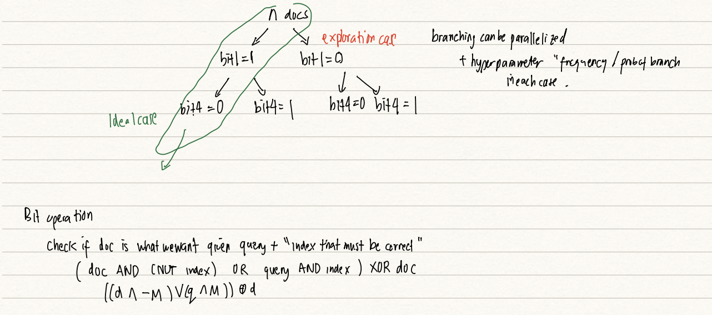
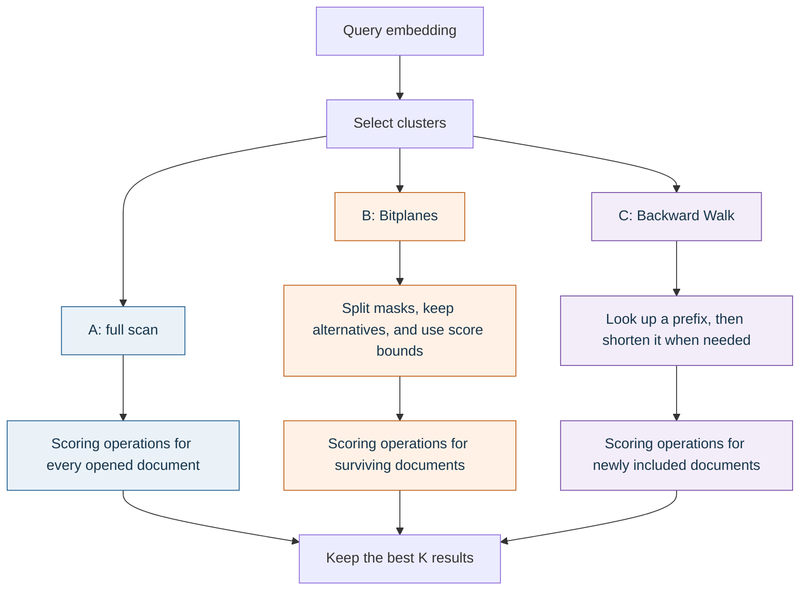
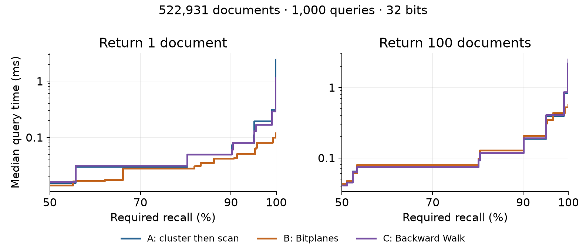

# Reimagining Search Using the Query’s Ideal Bit Pattern

*Exploring Bitplanes and Backward Walk*

I’m Vincentius Roger Kuswara, a software engineer at TikTok (TikTok Search team), based in Singapore.

The query tells us which binary document pattern would give the highest score value,
and how much each mismatched bit would reduce it. Can we use that information to find
the best stored documents with fewer document scoring operations?

This repository explores that question with a C++ implementation, Python experiments,
and a report that follows the calculations through to measured results.

**[Read the report](output/pdf/search-methods-prefix-v3.pdf)** ·
**[Try the small example](examples/prefix_search.py)** ·
**[Explore the results](results/prefix-study-2026-09-13/README.md)**

## Early sketches

Some references from my ideation scratch notes:

<table>
  <tr>
    <td width="50%"><a href="docs/ideation/original-pipeline.png"></a></td>
    <td width="50%"><a href="docs/ideation/first-bitplane-idea.png"></a></td>
  </tr>
  <tr><td>Original pipeline</td><td>First Bitplane idea</td></tr>
</table>

<details>
<summary>More sketches</summary>





</details>

## The idea

Consider this query:

```text
Query values:       [0.7, -0.2, 0.1]
Ideal bit pattern:  [  1,    0,   1]
```

The document bit `1` means `+1`; `0` means `-1`. The pattern `101` therefore gives
`0.7 + 0.2 + 0.1 = 1.0`, the highest possible score value for this query.
Getting the first bit wrong reduces that value by `1.4`; getting the last bit wrong
reduces it by only `0.2`.

We know this before examining the documents. We can use it to choose which branches
to visit, which prefixes to look up, and when an unexplored set cannot improve the
results. The ideal pattern might not exist in the collection, so we still need to
find the best documents that are actually stored.

Here, **a document scoring operation** is the computation for one document;
**a score value** is its numerical result.

## Three ways to search

All three methods start by selecting clusters. The difference is how they search
the documents inside them.



| Method | What it does | Additional work |
|---|---|---|
| **A: full scan** | Performs a scoring operation for every document in the opened clusters. | No additional filtering inside a cluster. |
| **B: Bitplanes** | Uses query signs and magnitudes to split document masks, retain alternatives, and skip branches when possible. | Reading masks and managing branches. |
| **C: Backward Walk** | Starts at the query’s sign prefix, shortens it one bit at a time, and processes only newly included documents. | Prefix lookups and range updates. |

B and C reuse A’s full scoring function. Their additional search work is worthwhile
only when the document scoring operations avoided save more time than that work costs.

## Results in the report

The broad study uses two collections and models, with **1,000 fixed queries per pool**:

| Collection | Documents | Embedding model | Bits per document |
|---|---:|---|---|
| BEIR Quora | 522,931 | Qwen3-Embedding-0.6B | 32, 256, 1024 |
| MS MARCO passages | 1,000,000 | Nomic embed-text-v1.5 | 64, 256, 768 |

Within each pool, A, B and C receive the same documents, queries and exact reference
results. Each method chooses its fastest tested settings that meet the same recall
requirement and the same 32 GB process-memory limit. Queries run one at a time on an
Apple M5 Max with 128 GiB RAM. Query embeddings are cached; the times below include
cluster selection and index search.

For **Quora with 32-bit Qwen embeddings, one returned result, and a 99% recall target**:

| Method | Clusters / probes | Achieved recall | Repeated median time |
|---|---|---:|---:|
| A: full scan | 4096 / 180 | 99.0% | 0.195 ms |
| B: Bitplanes | 16 / 9 | 99.2% | **0.081 ms** |
| C: Backward Walk | 1024 / 78 | 99.0% | 0.169 ms |

B is about **2.4 times faster than A** in this setup. It opens much larger clusters
but performs only about 818 document scoring operations per query. The report also
compares local search with the **same opened clusters** to separate that benefit
from changes in routing.



The graph selects the fastest completed settings meeting each recall requirement;
the table reports repeated measurements of the selected settings. The time axes
use a logarithmic scale.

C has a useful conditional case: in a separate global exact-search experiment,
82 of 1,000 queries have an existing document with the query’s complete 32-bit
pattern. C takes a median **4.875 microseconds** on those queries, but B remains
faster across all 1,000. That subgroup is shown alongside the rest of the queries.

At the **99% recall target with 100 returned results**, the selected B and C settings
instead perform scans across all six pools. There is no general winner across
every representation and search setting.

**Shorter embeddings also change the ranking.** Qwen32’s exact binary top-1 result
agrees with the full 1024-value embedding’s best score value on only **14% of queries**.
High recall against a short binary reference is therefore not the same as preserving
full-embedding quality, and neither measure is a human relevance judgment.

The [results guide](results/prefix-study-2026-09-13/README.md) includes parameter
settings, raw measurements, repeat ranges, memory use, and partial-run coverage.
The [same-cluster comparison](results/same-clusters-2026-09-13/README.md) reports
local search time and recall with the opened documents held fixed.

## Try the three-document example

Use Python 3.12, `uv`, and a C++20 compiler. On macOS, the Xcode command-line tools
provide the compiler. The example needs no dataset or model download.

```sh
git clone https://github.com/rgrexplore/query-guided-search-exploration.git
cd query-guided-search-exploration
uv venv --python 3.12
uv pip install --python .venv/bin/python -e '.[test]'
.venv/bin/python examples/prefix_search.py
```

All three methods return IDs 1 and 2. A performs three document scoring operations;
B and C perform two. The output also shows their additional mask and prefix work.
`requirements.lock` records the tested Python environment.

## From the report to the code

| Topic | Start here |
|---|---|
| Shared scoring function and top-K results | [cpp/score.hpp](cpp/score.hpp) |
| A: scan and B: Bitplanes | [cpp/index.cpp](cpp/index.cpp) |
| C: Backward Walk | [cpp/prefix_index_v2.cpp](cpp/prefix_index_v2.cpp) |
| Python interface | [cpp/bindings.cpp](cpp/bindings.cpp) |
| Small worked example | [examples/prefix_search.py](examples/prefix_search.py) |
| Experiment preparation, execution and repeats | [experiments/prefix_study_v2.py](experiments/prefix_study_v2.py) |
| Local search in the same clusters | [experiments/same_clusters.py](experiments/same_clusters.py) |
| Work and memory checks | [experiments/prefix_work_checks_v2.py](experiments/prefix_work_checks_v2.py) |
| Report source and build command | [reports/search-math-prefix-v3](reports/search-math-prefix-v3) |

For larger experiments, follow [data and model preparation](docs/expanded-pool-preparation.md),
then use the commands in the [results guide](results/prefix-study-2026-09-13/README.md).
Large embedding arrays are kept in the ignored `data/` directory and must be prepared
separately. Saved tables and figures can be read without those arrays.

## Acknowledgments

Special thanks to the [exa.ai](https://exa.ai) team for sharing their engineering work
through the Exa blog. Their post on [building a web-scale vector database](https://exa.ai/blog/building-web-scale-vector-db)
inspired this project and the experiments in the report. The implementation here
is a local CPU experiment based on that public description.
