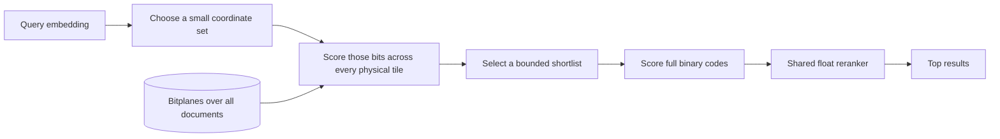

# Where bitplanes might help latency

Research notes, 9 September 2026. These are proposed experiments, not new performance results.
The completed FiQA sweep remains the measured baseline. The objective here is single-query
latency at useful retrieval quality, with batched throughput reported separately.

## Separate the knobs

A 256-bit document currently means 256 embedding coordinates, each stored as one sign bit.
Embedding width and precision per coordinate are different choices. Bitplanes are a storage
layout; they do not require recursive search, one-bit precision, or a semantic router.

| Increase this | Cost that tends to grow | What might justify it |
|---|---|---|
| Documents N | Code traffic, scoring and selection; possible memory-capacity transitions | More coverage; a larger search scope may amortize setup overhead |
| Dimensions D | Wider codes, centroid comparisons and refinement | Better representation could reduce probes or candidate counts |
| Bits per coordinate | Code traffic and arithmetic | Better approximate scores could shrink the refinement shortlist |
| IVF probes | More documents and lists searched | Fewer routing misses |
| IVF clusters | More centroid work and smaller lists; training/storage also grow | Better partitioning, if preserving quality does not need many more probes |
| Shortlist C / rerank count R | Selection, scattered vector gathers and final scoring | More recovery from approximate first-stage mistakes |
| Query batch size | Queueing delay and workspace; more reuse of document tiles | Higher throughput, not automatically lower interactive latency |
| Concurrent queries | Competition for memory bandwidth and compute | Throughput, until contention hurts p95 latency |

Actual IVF work is determined by the documents in selected lists, not just probes/clusters.
Large or skewed lists make the simple fraction optimistic. Faiss describes both this imbalance
and the tradeoff between centroid assignment and list scanning. When all IVF lists must be
visited, its FAQ recommends Flat because IVF's routing no longer saves work.
[Faiss index guide](https://github.com/facebookresearch/faiss/wiki/Faiss-indexes),
[Faiss FAQ](https://github.com/facebookresearch/faiss/wiki/FAQ).

Binary quantization already cuts code payload: a D-dimensional code takes D/8 bytes, versus
4D bytes for float32. That storage advantage belongs to a plain binary scan as well. Bitplanes
must demonstrate an additional benefit over that strong baseline.

## A byte budget before a latency claim

Let f be the actual fraction of documents scanned by IVF, m the coordinates used by a global
cheap pass, C its full-binary shortlist, and R the shared final float rerank count.
Ignoring metadata, cache-line effects and intermediate state:

- IVF binary scan reads about f × N × D / 8 code bytes, plus routing and reranking.
- Global m-plane filtering reads about N × m / 8 input bytes, then C × D / 8 survivor bytes.
- Final float32 reranking reads about R × D_full × 4 vector bytes in either pipeline.

These are payload estimates, not measured memory traffic or latency. A regular kernel may run
faster despite reading more, and a complicated filter may run slower despite reading less.
Accumulator writes, thresholding, top-C selection, cache misses and dispatch still count.

An illustrative one-million-document corpus with 1,024-bit codes:

| Work | Code payload |
|---|---:|
| Full binary scan | 128 MB |
| IVF scanning 1% of documents | 1.28 MB |
| IVF scanning 20% of documents | 25.6 MB |
| Global pass over 32 bitplanes | 4 MB, before survivor scoring and intermediate traffic |

So high-dimensional, broad-search workloads are plausible candidates. A good IVF router that
needs only 1% of the corpus is a much harder opponent. In the current IVF/4 FiQA setting,
f is about 7.02%; m=32 out of D=256 is 12.5%. The global pass would already read more input
payload, so reduced reads are not its advantage there.

Increasing N alone does not fix this ratio: both payloads grow linearly. At one billion documents,
32 global planes are already 4 GB per query. Even an illustrative sustained 100 GB/s would need
40 ms just for those reads. That is arithmetic, not a measured bandwidth or predicted latency
for this machine. A physical tile layout avoids giant temporary masks; it does not make a global
scan sublinear.

## Higher dimensions are not automatically better for filtering

The cached Nomic model has 768 dimensions, so 256/512/768 comparisons can reuse its full vectors.
Dimensions above that require a different encoder or a meaningful new representation, not padding.
More coordinates help only if the retrieval benefit repays their cost.

A read-only diagnostic on all 648 cached FiQA queries measures the sum of the largest absolute
query coordinates divided by the sum across the selected prefix:

| Vector width | Largest 32 coordinates | Largest 64 coordinates |
|---|---:|---:|
| 256 | 31.62% | 52.15% |
| 512 | 18.04% | 31.12% |
| 768 | 12.87% | 22.60% |

These are mean absolute-weight fractions, not recall or predicted speedup. They show that the
same small coordinate subset covers less of the score as width increases. A good small shortlist
may therefore require more coordinates or more survivors. Bit balance and correlation matter too:
a large query coordinate whose document bit is almost constant offers little discrimination.

Rotations are another tradeoff. An orthogonal rotation preserves full-vector dot products, but
sign quantization and truncation do not commute with it. Spreading information can improve some
quantizers while weakening a largest-coordinate subset strategy. Keep each representation explicit.

## Candidate A: a global weighted bitplane pass

This keeps the idea of query-dependent bit importance but removes the best-first tree.

Tiles are fixed ranges of document rows, perhaps 256–1,024 rows each. They are memory chunks,
not semantic clusters: every tile is considered. A shortlist can still miss a relevant document,
but it cannot miss it solely because an IVF list was never opened.

For an initial variant, select m large-|q| coordinates. Convert their nonnegative mismatch
weights to small integers, say three or four bits. Each mismatching document gets a penalty;
several small mismatches can remain competitive with one large mismatch. This is a soft score,
not a requirement that every selected sign match.

CPU implementation hypothesis: keep the per-document counters themselves as bitplanes. Boolean
operations then update 64 document counters together. Use fixed scratch storage per worker,
process tiles in a predictable order, and select candidates without creating a heap of tree nodes.
This is related to established bit-sliced arithmetic and top-k algorithms.
[Bit-Sliced Index Arithmetic, Rinfret and O'Neil/O'Neil, 2001](https://sigmodrecord.org/2001/06/07/bit-sliced-index-arithmetic/).

If m integer weights each use b bits, a safe counter width is
ceil(log2(m × (2^b − 1) + 1)). For m=32 and b=4, that is nine counter bitplanes. Straightforward
addition takes roughly m × counter_width × N/64 word steps, each containing multiple Boolean
operations. Processing 64 lanes together is not a promise of 64x speedup.

The main failure modes are concrete:

- m or C must become large to preserve quality, eliminating savings.
- Low-bit scores tie. At m=32, b=4, only 481 integer penalty values exist. Keeping arbitrary
  documents at the cutoff may hurt recall; keeping every tie may destroy the latency bound.
- Sparse survivors are spread across most tiles. With independently scattered 1% survivors,
  a 64-row block is nonempty with probability 1 − 0.99^64, about 47%. Active-row fraction and
  active-block traffic are not interchangeable. This is an illustrative model, not a data finding.
- A metadata mask saves plane reads mainly when whole tiles can be skipped; scattered eligible
  rows can still require broad reads. A direct gather/scan is a necessary baseline for sparse IDs.

Compare this against an equally staged row-oriented scorer and a compact Matryoshka prefix scan.
If shortening the representation explains the gain, report that rather than crediting bitplanes.
The same filter can also run inside IVF lists; routing should remain a switch in the experiment.

## Candidate B: regular low-bit matrix scoring on the GPU

The score already has a matrix form. With queries Q and signed document rows S in {-1,+1},
all scores are Q × Sᵀ. One query is matrix-vector work; several queries reuse document tiles
in matrix-matrix work. Coarse centroid scoring and final float reranking also have matrix forms.

Packed one-bit arrays are not ordinary matrix-library inputs. Options include expanding signs
to float16, repacking into a supported low-bit format, or writing a packed custom kernel. Float16
expansion alone costs 16 times the one-bit payload. Extra GPU arithmetic capacity must repay any
extra data movement. XOR/popcount with only the query's signs changes the metric by discarding
its magnitudes; weighted bit-serial scoring requires additional query weight planes.

On this Apple machine, MLX is a practical first baseline. Its affine quantized matmul supports
2/3/4/5/6/8-bit weights. Proposed encoding: use two-bit codes 0/1 with scale 2 and bias -1 to
represent the same document signs. This preserves the represented values algebraically but uses
more code storage plus scale/bias arrays; numerical accumulation must be checked against the
CPU scorer. It is an untested adaptation, not an assertion that the API directly accepts our
one-bit buffers. [MLX matrix API](https://ml-explore.github.io/mlx/build/html/python/_autosummary/mlx.core.quantized_matmul.html),
[format details](https://ml-explore.github.io/mlx/build/html/python/_autosummary/mlx.core.quantize.html).

A custom scorer could store [tile][packed-coordinate-word][document-lane], so adjacent GPU lanes
read adjacent words. Keep code buffers resident, compute local top candidates, and merge them.
Avoid a separate GPU dispatch per branch or a CPU synchronization after each bitplane. If writing
a custom kernel, fuse scoring and local selection where practical instead of materializing all
query-by-document scores. GPU nearest-neighbor research treats top-k selection as a first-class
cost. [Johnson, Douze and Jégou](https://arxiv.org/abs/1702.08734),
[NVIDIA memory-access guidance](https://docs.nvidia.com/cuda/cuda-c-best-practices-guide/index.html).

Apple unified memory avoids a mandatory separate CPU-to-discrete-GPU copy of each array, but
synchronization, memory bandwidth and capacity limits remain. The CUDA-based Faiss and cuVS paths require
NVIDIA hardware and are separate from the current Apple path.
[MLX unified memory](https://ml-explore.github.io/mlx/build/html/usage/unified_memory.html).

| Pipeline operation | Natural implementation to compare |
|---|---|
| Query encoder / projection | Existing model tensor kernels; report its latency separately |
| IVF centroid scores | CPU vector math or GPU matrix scoring |
| Weighted bitmap filter | CPU word/SIMD operations or a regular GPU integer kernel |
| Full compressed-code scores | CPU blocked lookup tables, supported GPU low-bit matmul, or a packed GPU kernel |
| Candidate selection | CPU partial selection / bitmap thresholding, or GPU block-local selection and merge |
| Float refinement | Gather selected vectors, then vector/matrix products on the chosen device |

Turning the tree into a large sparse matrix is not automatically helpful: its query-dependent
control flow still costs work. The useful transformation is regularizing the workload itself.
Waiting to form a large batch can improve throughput while increasing interactive latency.

## Closely related work to use as baselines

- **ClickHouse QBit** stores coordinate precision in bitplanes. Its 26.7 release adds lower-bit
  storage, partial-dimension reads and rotations. This directly supports exploring precision and
  dimension as query-time controls. It does not prove our direct weighted-bitmap scorer wins.
  [Architecture](https://clickhouse.com/blog/qbit-vector-search),
  [26.7 release](https://clickhouse.com/blog/clickhouse-release-26-07).
- **Panorama** progressively compares vector dimensions with bounds and an execution-oriented
  layout. It is a relevant non-bitplane alternative to our optimistic sign bound.
  [Paper](https://arxiv.org/abs/2510.00566).
- **Faiss FastScan** combines compact codes with SIMD-friendly block layout and lookup tables.
  Its kernels are stronger baselines than assuming our readable scalar scan is the hardware limit.
  [Official documentation](https://github.com/facebookresearch/faiss/wiki/Fast-accumulation-of-PQ-and-AQ-codes-%28FastScan%29).
- **IVF-RaBitQ on GPU** combines clustering, quantization and hardware-specific kernels; it is
  evidence that these are composable choices, not mutually exclusive camps. Its published
  throughput results do not establish single-query latency on this Mac.
  [Paper](https://arxiv.org/abs/2602.23999).

## A small experiment sequence

First compare the existing packed CPU scan with a cluster-free scan, an Apple matrix baseline,
and a compact prefix-then-rerank baseline. Keep source data and final evaluation reference fixed.
This establishes whether routing or hardware utilization is the actual opportunity before
building a new bitplane scorer.

Then test Candidate A on both global and IVF-restricted scopes. Start at the existing corpus and
one larger real collection; repeat on new queries after choosing settings. Use 256/512/768 widths
from the existing encoder, m=16/32/64/128, and an independently tuned shortlist count. These are
suggested axes, not a commitment to run their full Cartesian product. Stop if the filter needs
nearly full scoring or loses to the simple prefix baseline at the same quality.

Treat single-query p50 and p95 as primary. Report query encoding, preprocessing, routing, coarse
scoring, selection, survivor gathers, full scoring and final reranking separately, plus total
synchronized latency. Also record bytes, nodes/tiles, survivor counts, tied cutoff size, peak memory
and throughput under concurrency. For GPU runs, synchronize before stopping the timer and include
necessary copies or format conversion unless they are genuinely one-time preprocessing.

Compare minimum observed latency at several fixed quality targets on development data, then freeze
for held-out evaluation. Use a fixed full-vector neighbor reference and dataset relevance labels;
do not let each shorter representation define its own success. Include weak and unattainable
settings. Binary fidelity, semantic relevance, build cost and memory remain separate measurements.

With float32 768-D refinement vectors, one million documents need about 3.07 GB for that array and
ten million need 30.72 GB, before codes, text, caches and overhead. A 128 GiB machine makes this
scale plausible for a local study, but 100 million full vectors alone exceed its memory. Model
encoding time and dataset acquisition remain separate constraints.

The current best hypothesis is a regular, bounded first pass over a broad candidate population,
followed by small refinement. It could help when routing must inspect much of the corpus, vectors
are expensive enough, and a cheap score preserves a small useful shortlist. It remains unmeasured.
