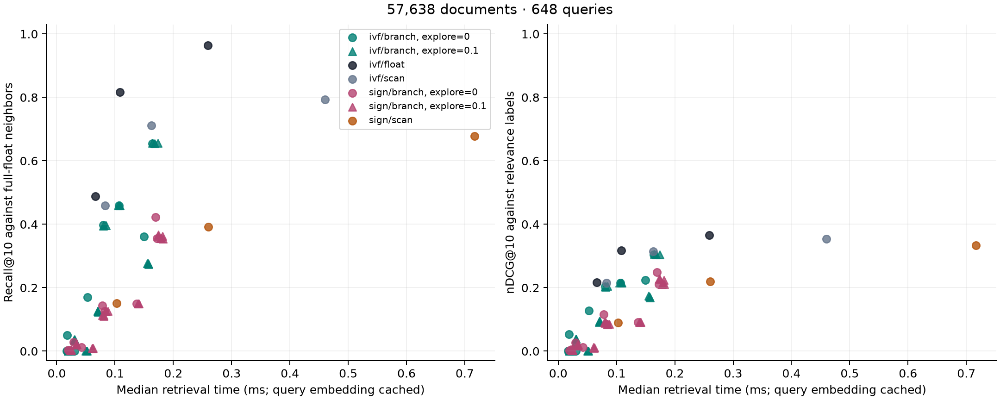

# FiQA rerun after readability cleanup

Full FiQA corpus: **57,638 documents and 648 queries**. Same embeddings, settings and search
algorithms as the earlier runs. The source now uses top-level imports, expanded expressions,
and named C++ binding functions. Power observations showed AC power and mode 2 throughout the
three samples; no changes were detected.

| Setting | Median retrieval ms | Full-float Recall@10 | nDCG@10 |
|---|---:|---:|---:|
| IVF binary scan, 1 probe | 0.083 | 0.459 | 0.215 |
| IVF branching, 1 probe, 512 nodes, explore 0 | 0.107 | 0.459 | 0.215 |
| IVF binary scan, 4 probes | 0.163 | 0.712 | 0.314 |
| IVF branching, 4 probes, 512 nodes, explore 0 | 0.164 | 0.655 | 0.304 |
| Faiss float IVF, 4 probes | 0.108 | 0.817 | 0.317 |

Quality and work counts are unchanged for every measured request. The broad outcome also stays
the same: this sweep did not establish a matched-quality branching speedup, and exploration at
0.1 did not consistently improve results. Low node budgets can return few or no candidates.

Times include routing, the search call and shared float reranking. Query encoding is excluded.
Faiss float-IVF uses a different candidate score; the controlled comparison is binary scan versus
branching in identical buckets.

- [All 81 settings](report.md), [summary CSV](summary.csv), and `queries.csv.gz`.
- [One query's branches](trace.md) and [full trace](trace.json).
- [Power observations](power-observations.json) and [run metadata](metadata.json).
- [Comparison with both earlier runs](../README.md).

Source hashes in the metadata match this version of the code. The compressed CSV contains all
157,464 requests; the generated run directory has the same table as plain `queries.csv`.
