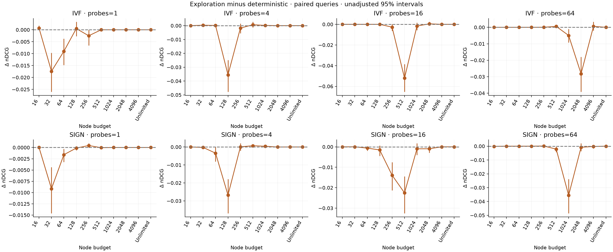

# FiQA: denser search curves

This run expands the original 81 settings to **583 settings including random seeds**, or 303
policies after averaging seeds. It uses all **57,638 documents and 648 queries**, with three timing
repeats: **1,133,352 measured requests**. The index and cached embeddings are unchanged.

Start with the [graphs and complete tables](analysis/report.md). The [protocol](protocol.md) and
[configuration](experiment.toml) were fixed before this run. Earlier runs are preserved separately.

## What changed in the picture

There is a useful region for branching within the sign-routing pipeline. Searching more buckets
with a limited branch budget can recover better results than scanning fewer buckets, at a lower
observed median time. The table shows two nearby examples, alongside the stronger float baseline.
Higher recall and nDCG are better; lower latency is better.

| Method | Buckets searched | Node budget | Median ms | Float Recall@10 | nDCG@10 |
|---|---:|---:|---:|---:|---:|
| Sign binary scan | 16 | — | 0.7524 | 0.6784 | 0.3341 |
| Sign branching | 32 | 2,048 | 0.6256 | 0.7006 | 0.3447 |
| Sign branching | 64 | 2,048 | 0.6466 | 0.7062 | 0.3455 |
| Faiss float-IVF | 8 | — | 0.1661 | 0.9127 | 0.3534 |

Both branching rows use deterministic ordering. These examples were selected after inspecting
the full grid: they describe a promising combined routing/search tradeoff, not a confirmed winner
on new queries. The different bucket scopes mean this does not isolate traversal efficiency.
Faiss float-IVF uses a different scorer and remains the stronger measured baseline here.

## What did not improve

Inside the **same selected buckets**, unlimited branching gives exactly the scan's candidates but
its deterministic median time is **1.32–2.23 times longer** across the 15 scopes. It still scores
at least 99.93% of routed documents on average, so traversal adds work without avoiding much scoring.
No finite-budget policy in this sweep is both faster than its same-bucket scan and at least as
good in mean nDCG. Small timing differences should not be interpreted as reproducible speedups.

For example, with four IVF buckets, the scan takes 0.1703 ms with 0.7119 float recall and 0.3139
nDCG. A 512-node branch search takes 0.1692 ms with 0.6546 recall and 0.3041 nDCG. Its paired nDCG
change is −0.00979, with an exploratory 95% interval of [−0.01778, −0.00274]. Unlimited branching
restores scan quality but takes 0.2910 ms.

Random exploration at 0.1 does not offer a consistent improvement. Across 126 finite-budget
comparisons, mean nDCG rises in 25, falls in 56 and stays unchanged in 45. These settings are
correlated, so those counts are a description, not independent trials. Some tiny gains remain
in the table. At IVF/16 buckets/512 nodes, exploration lowers mean nDCG by 0.05205, with interval
[−0.06541, −0.03845]. It can reduce empty returns while finding less relevant candidates.

## Where accuracy goes

Routing and candidate selection are separate sources of loss. Searching every bucket—64 for IVF,
120 occupied addresses for sign routing—gives identical binary-scan quality: 0.80386 float recall
and 0.35809 nDCG. Removing routing loss therefore does not remove the loss from binary scoring and
the 100-candidate cutoff. The full 768-D reference has 0.37456 nDCG.

Some low-budget requests return nothing. IVF/16 buckets/32 nodes returns zero candidates for all
648 queries. Those requests stay in every average; their low latency is not useful retrieval speed.
The [completion plot](analysis/completion.png) makes this visible.

## How this was checked

All conditions were shuffled globally for each repeat. Query order changed between repeats but
stayed shared across conditions. The original query row determines the random seed. There were
31 power observations, all AC power/mode 2; sampling cannot rule out changes between observations,
thermal effects or ordinary desktop activity. Timings include routing, search and float reranking,
with query embeddings cached. They are not text-to-answer latency.

The analysis checks every planned setting, seed, query and repetition. Accuracy and work counts
are identical across timing repeats. All **110,808 unlimited candidate checks** matched the exact
scan, including ranking ties. Measurement source hashes match. The test suite passes **124 tests**.
See [verification](verification.json) and [power observations](power-observations.json).

Quality intervals resample the 648 queries, pairing compared methods and averaging exploration
seeds inside each query. The 1,000 bootstrap draws do not turn timing repeats into extra examples.
Intervals are unadjusted for multiple comparisons and conditional on this dataset and these seeds.
This is an exploratory follow-up on an already examined FiQA split. Confirmation on a new dataset
or held-out queries is still needed for broader claims.

## Files and reproduction

- [All per-seed settings](summary.csv) and [seed-averaged policies](analysis/settings.csv).
- [Paired differences and intervals](analysis/paired_differences.csv).
- [Every request](queries.csv.gz) and [per-query summaries](analysis/query_summary.csv.gz), compressed.
- [Measurement identity](metadata.json), [analysis identity](analysis/metadata.json), and [schedule](schedule.json).
- [One query trace](trace.md); the complete trace is in `trace.json`.

The original working run is `runs/20260909T055937544570Z/`, with uncompressed CSV files. From the
project root, redraw it with `.venv/bin/python analyze.py runs/20260909T055937544570Z`.
To analyze this archive directly, decompress `queries.csv.gz` first. The gzip copies were checked
against the original byte hashes. Analysis code and input hashes are recorded separately from
measurement code, so plots can change without rerunning search. Display-only changes after the run
removed an empty legend entry and used shared zero-based nDCG scales; the numerical results stayed
unchanged.
