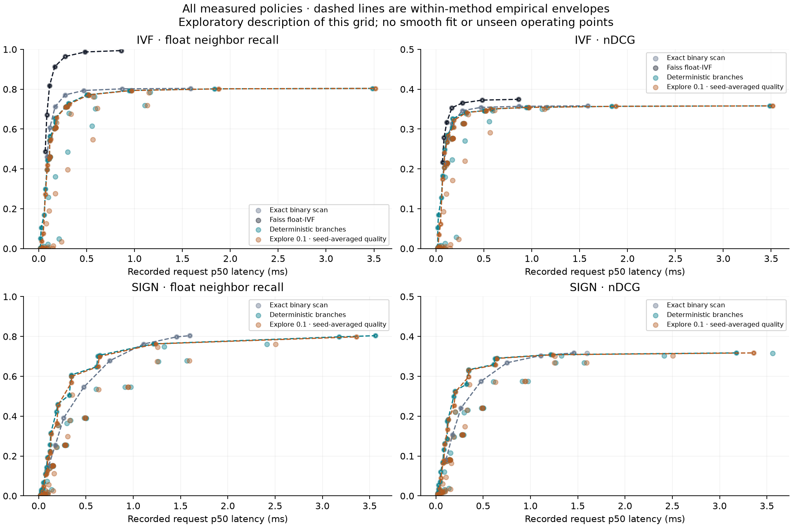
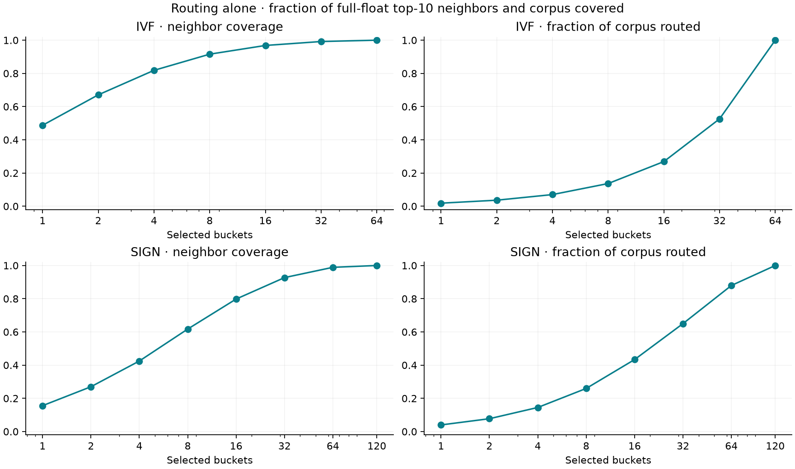
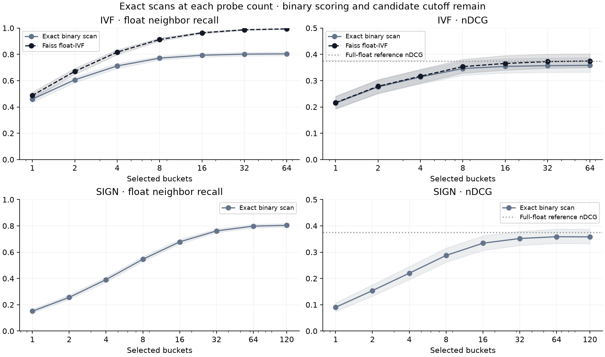
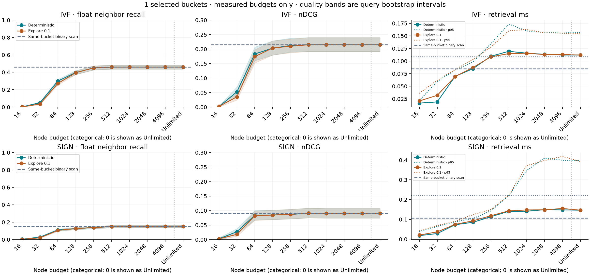
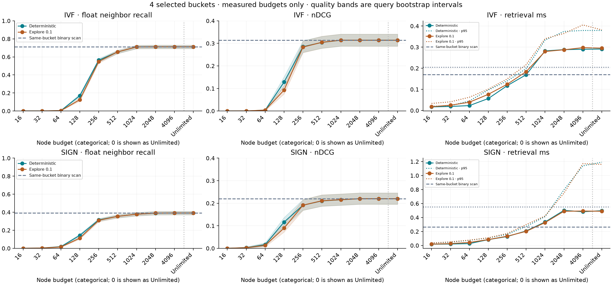
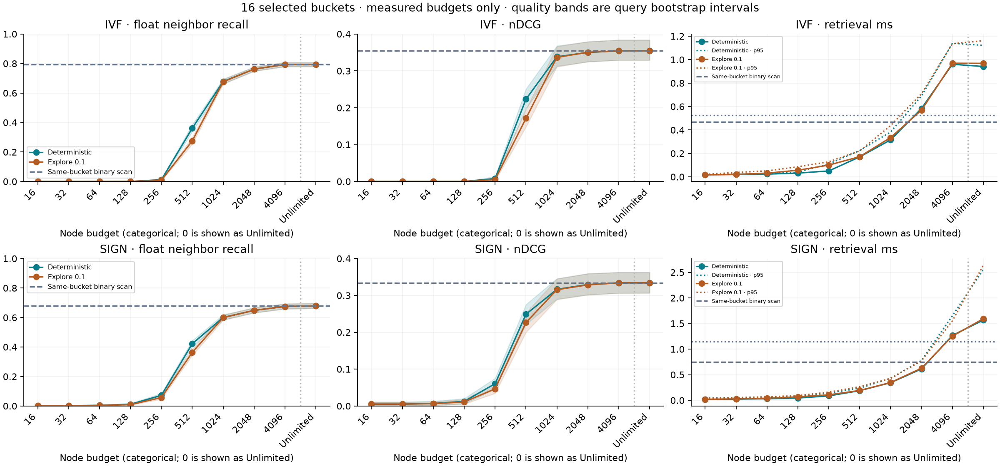
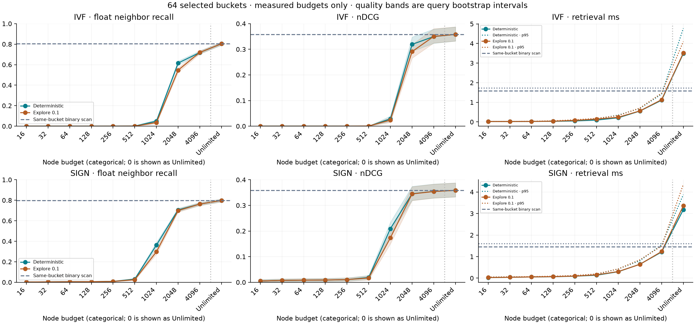
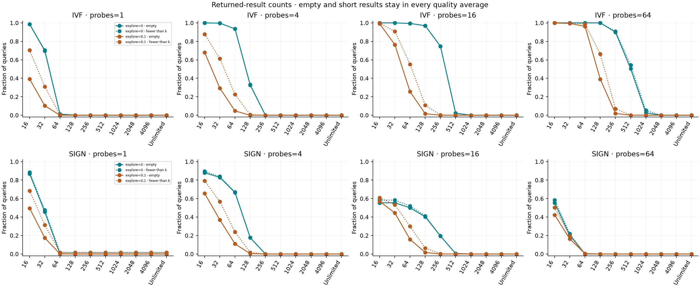

# Search measurements

57,638 documents, 648 queries, 583 cases, 3 timing repetitions per query and case.

Quality uses each query once. Random policies average their search seeds within each query; timing repetitions do not add quality observations. The settings table records seed counts and the range of seed means.

Times describe warm CPU requests with cached query embeddings: routing, search call and float reranking. Request p50/p95 include every recorded timing repetition. Query-median p50/p95 first take the median over timing repetitions, then average seeds within each query. These are different summaries; neither is an uncertainty interval for another machine or run.

Quality bands and paired differences use 1,000 query-bootstrap draws (seed 20260909). Every comparison uses the same resampled query IDs. Intervals are unadjusted and exploratory, conditional on this corpus, query set, router and search seeds. They do not correct for selecting among many settings.

IVF and sign routing have different bucket sizes and counts. Equal probes do not mean equal work. Routing coverage measures full-float reference neighbors present before binary scoring and candidate selection. The scan curves include those later losses. Float-IVF is a separate baseline, not the controlled binary comparison.

Unlimited is a separate category after the finite budgets, not numeric zero on a log axis. All measured settings and failures remain in the tables; lines only connect measurements. The detailed budget figures show the preselected probe counts 1, 4, 16 and 64.
nDCG panels start at zero and share one upper limit within each figure, rounded up to the next tenth from all displayed values, confidence bounds and any reference line (capped at 1). Recall panels retain the full 0–1 scale. This display choice does not change measurements or comparisons.

The overview retains every policy point. Dashed envelopes connect measured nondominated points within each method and exploration policy. They are descriptive, selected from this same grid, and do not establish tuned winners or performance between observations.

## Recorded checks

Unlimited settings: 29; settings below exact same-bucket binary recall: 0.

An unlimited mismatch needs checking before treating the run as valid. An empty routed scope has zero recall by convention; the query table records routed_documents so that case can be distinguished from a search mismatch.

## All settings

| Router / method | Probes | Budget | Explore | Seeds | p50 ms | p95 ms | Float recall | nDCG | Empty | < k |
|---|---:|---:|---:|---:|---:|---:|---:|---:|---:|---:|
| ivf/branch | 1 | Unlimited | 0 | 1 | 0.1121 | 0.1574 | 0.459 | 0.215 | 0.000 | 0.000 |
| ivf/branch | 1 | Unlimited | 0.1 | 3 | 0.1119 | 0.1539 | 0.459 | 0.215 | 0.000 | 0.000 |
| ivf/branch | 1 | 16 | 0 | 1 | 0.0165 | 0.0215 | 0.002 | 0.002 | 0.986 | 0.986 |
| ivf/branch | 1 | 16 | 0.1 | 3 | 0.0207 | 0.0361 | 0.002 | 0.002 | 0.391 | 0.704 |
| ivf/branch | 1 | 32 | 0 | 1 | 0.0190 | 0.0595 | 0.051 | 0.053 | 0.698 | 0.705 |
| ivf/branch | 1 | 32 | 0.1 | 3 | 0.0320 | 0.0617 | 0.036 | 0.035 | 0.102 | 0.310 |
| ivf/branch | 1 | 64 | 0 | 1 | 0.0696 | 0.0820 | 0.300 | 0.183 | 0.012 | 0.012 |
| ivf/branch | 1 | 64 | 0.1 | 3 | 0.0693 | 0.0829 | 0.272 | 0.174 | 0.000 | 0.004 |
| ivf/branch | 1 | 128 | 0 | 1 | 0.0849 | 0.0981 | 0.397 | 0.203 | 0.000 | 0.000 |
| ivf/branch | 1 | 128 | 0.1 | 3 | 0.0872 | 0.1032 | 0.396 | 0.204 | 0.000 | 0.000 |
| ivf/branch | 1 | 256 | 0 | 1 | 0.1096 | 0.1344 | 0.450 | 0.212 | 0.000 | 0.000 |
| ivf/branch | 1 | 256 | 0.1 | 3 | 0.1085 | 0.1278 | 0.450 | 0.210 | 0.000 | 0.000 |
| ivf/branch | 1 | 512 | 0 | 1 | 0.1194 | 0.1736 | 0.459 | 0.215 | 0.000 | 0.000 |
| ivf/branch | 1 | 512 | 0.1 | 3 | 0.1148 | 0.1601 | 0.459 | 0.215 | 0.000 | 0.000 |
| ivf/branch | 1 | 1024 | 0 | 1 | 0.1157 | 0.1599 | 0.459 | 0.215 | 0.000 | 0.000 |
| ivf/branch | 1 | 1024 | 0.1 | 3 | 0.1157 | 0.1627 | 0.459 | 0.215 | 0.000 | 0.000 |
| ivf/branch | 1 | 2048 | 0 | 1 | 0.1134 | 0.1570 | 0.459 | 0.215 | 0.000 | 0.000 |
| ivf/branch | 1 | 2048 | 0.1 | 3 | 0.1129 | 0.1561 | 0.459 | 0.215 | 0.000 | 0.000 |
| ivf/branch | 1 | 4096 | 0 | 1 | 0.1121 | 0.1556 | 0.459 | 0.215 | 0.000 | 0.000 |
| ivf/branch | 1 | 4096 | 0.1 | 3 | 0.1132 | 0.1556 | 0.459 | 0.215 | 0.000 | 0.000 |
| ivf/float | 1 | — | 0 | 1 | 0.0673 | 0.0797 | 0.487 | 0.216 | 0.000 | 0.000 |
| ivf/scan | 1 | — | 0 | 1 | 0.0849 | 0.1088 | 0.459 | 0.215 | 0.000 | 0.000 |
| ivf/branch | 2 | Unlimited | 0 | 1 | 0.1714 | 0.2286 | 0.606 | 0.276 | 0.000 | 0.000 |
| ivf/branch | 2 | Unlimited | 0.1 | 3 | 0.1765 | 0.2447 | 0.606 | 0.276 | 0.000 | 0.000 |
| ivf/branch | 2 | 16 | 0 | 1 | 0.0175 | 0.0238 | 0.000 | 0.000 | 1.000 | 1.000 |
| ivf/branch | 2 | 16 | 0.1 | 3 | 0.0196 | 0.0352 | 0.000 | 0.001 | 0.502 | 0.778 |
| ivf/branch | 2 | 32 | 0 | 1 | 0.0185 | 0.0230 | 0.003 | 0.002 | 0.975 | 0.975 |
| ivf/branch | 2 | 32 | 0.1 | 3 | 0.0267 | 0.0449 | 0.003 | 0.002 | 0.198 | 0.503 |
| ivf/branch | 2 | 64 | 0 | 1 | 0.0257 | 0.0739 | 0.105 | 0.084 | 0.545 | 0.548 |
| ivf/branch | 2 | 64 | 0.1 | 3 | 0.0472 | 0.0768 | 0.077 | 0.062 | 0.012 | 0.102 |
| ivf/branch | 2 | 128 | 0 | 1 | 0.0891 | 0.1171 | 0.444 | 0.249 | 0.000 | 0.000 |
| ivf/branch | 2 | 128 | 0.1 | 3 | 0.0886 | 0.1094 | 0.419 | 0.241 | 0.000 | 0.000 |
| ivf/branch | 2 | 256 | 0 | 1 | 0.1130 | 0.1310 | 0.543 | 0.267 | 0.000 | 0.000 |
| ivf/branch | 2 | 256 | 0.1 | 3 | 0.1150 | 0.1334 | 0.541 | 0.267 | 0.000 | 0.000 |
| ivf/branch | 2 | 512 | 0 | 1 | 0.1618 | 0.1925 | 0.603 | 0.275 | 0.000 | 0.000 |
| ivf/branch | 2 | 512 | 0.1 | 3 | 0.1636 | 0.1948 | 0.602 | 0.275 | 0.000 | 0.000 |
| ivf/branch | 2 | 1024 | 0 | 1 | 0.1746 | 0.2529 | 0.606 | 0.276 | 0.000 | 0.000 |
| ivf/branch | 2 | 1024 | 0.1 | 3 | 0.1755 | 0.2422 | 0.606 | 0.276 | 0.000 | 0.000 |
| ivf/branch | 2 | 2048 | 0 | 1 | 0.1707 | 0.2282 | 0.606 | 0.276 | 0.000 | 0.000 |
| ivf/branch | 2 | 2048 | 0.1 | 3 | 0.1761 | 0.2423 | 0.606 | 0.276 | 0.000 | 0.000 |
| ivf/branch | 2 | 4096 | 0 | 1 | 0.1699 | 0.2287 | 0.606 | 0.276 | 0.000 | 0.000 |
| ivf/branch | 2 | 4096 | 0.1 | 3 | 0.1768 | 0.2448 | 0.606 | 0.276 | 0.000 | 0.000 |
| ivf/float | 2 | — | 0 | 1 | 0.0842 | 0.1394 | 0.671 | 0.278 | 0.000 | 0.000 |
| ivf/scan | 2 | — | 0 | 1 | 0.1160 | 0.1449 | 0.606 | 0.276 | 0.000 | 0.000 |
| ivf/branch | 4 | Unlimited | 0 | 1 | 0.2910 | 0.3789 | 0.712 | 0.314 | 0.000 | 0.000 |
| ivf/branch | 4 | Unlimited | 0.1 | 3 | 0.2953 | 0.3817 | 0.712 | 0.314 | 0.000 | 0.000 |
| ivf/branch | 4 | 16 | 0 | 1 | 0.0170 | 0.0200 | 0.000 | 0.000 | 1.000 | 1.000 |
| ivf/branch | 4 | 16 | 0.1 | 3 | 0.0179 | 0.0334 | 0.000 | 0.000 | 0.681 | 0.878 |
| ivf/branch | 4 | 32 | 0 | 1 | 0.0191 | 0.0222 | 0.000 | 0.000 | 0.997 | 0.997 |
| ivf/branch | 4 | 32 | 0.1 | 3 | 0.0249 | 0.0409 | 0.000 | 0.000 | 0.293 | 0.613 |
| ivf/branch | 4 | 64 | 0 | 1 | 0.0230 | 0.0454 | 0.004 | 0.003 | 0.935 | 0.935 |
| ivf/branch | 4 | 64 | 0.1 | 3 | 0.0390 | 0.0627 | 0.004 | 0.003 | 0.046 | 0.225 |
| ivf/branch | 4 | 128 | 0 | 1 | 0.0565 | 0.0970 | 0.170 | 0.128 | 0.326 | 0.332 |
| ivf/branch | 4 | 128 | 0.1 | 3 | 0.0765 | 0.1010 | 0.125 | 0.093 | 0.000 | 0.007 |
| ivf/branch | 4 | 256 | 0 | 1 | 0.1175 | 0.1398 | 0.564 | 0.285 | 0.000 | 0.000 |
| ivf/branch | 4 | 256 | 0.1 | 3 | 0.1242 | 0.1494 | 0.549 | 0.283 | 0.000 | 0.000 |
| ivf/branch | 4 | 512 | 0 | 1 | 0.1692 | 0.1983 | 0.655 | 0.304 | 0.000 | 0.000 |
| ivf/branch | 4 | 512 | 0.1 | 3 | 0.1840 | 0.2167 | 0.656 | 0.305 | 0.000 | 0.000 |
| ivf/branch | 4 | 1024 | 0 | 1 | 0.2821 | 0.3333 | 0.710 | 0.314 | 0.000 | 0.000 |
| ivf/branch | 4 | 1024 | 0.1 | 3 | 0.2793 | 0.3400 | 0.710 | 0.314 | 0.000 | 0.000 |
| ivf/branch | 4 | 2048 | 0 | 1 | 0.2881 | 0.3743 | 0.712 | 0.314 | 0.000 | 0.000 |
| ivf/branch | 4 | 2048 | 0.1 | 3 | 0.2875 | 0.3647 | 0.712 | 0.314 | 0.000 | 0.000 |
| ivf/branch | 4 | 4096 | 0 | 1 | 0.2899 | 0.3789 | 0.712 | 0.314 | 0.000 | 0.000 |
| ivf/branch | 4 | 4096 | 0.1 | 3 | 0.2974 | 0.4053 | 0.712 | 0.314 | 0.000 | 0.000 |
| ivf/float | 4 | — | 0 | 1 | 0.1125 | 0.1347 | 0.817 | 0.317 | 0.000 | 0.000 |
| ivf/scan | 4 | — | 0 | 1 | 0.1703 | 0.2050 | 0.712 | 0.314 | 0.000 | 0.000 |
| ivf/branch | 8 | Unlimited | 0 | 1 | 0.5032 | 0.6124 | 0.771 | 0.346 | 0.000 | 0.000 |
| ivf/branch | 8 | Unlimited | 0.1 | 3 | 0.5199 | 0.6450 | 0.771 | 0.346 | 0.000 | 0.000 |
| ivf/branch | 8 | 16 | 0 | 1 | 0.0173 | 0.0194 | 0.000 | 0.000 | 1.000 | 1.000 |
| ivf/branch | 8 | 16 | 0.1 | 3 | 0.0174 | 0.0263 | 0.000 | 0.000 | 0.872 | 0.961 |
| ivf/branch | 8 | 32 | 0 | 1 | 0.0193 | 0.0242 | 0.000 | 0.000 | 1.000 | 1.000 |
| ivf/branch | 8 | 32 | 0.1 | 3 | 0.0225 | 0.0380 | 0.000 | 0.000 | 0.463 | 0.765 |
| ivf/branch | 8 | 64 | 0 | 1 | 0.0224 | 0.0278 | 0.000 | 0.000 | 0.988 | 0.988 |
| ivf/branch | 8 | 64 | 0.1 | 3 | 0.0356 | 0.0584 | 0.000 | 0.000 | 0.111 | 0.375 |
| ivf/branch | 8 | 128 | 0 | 1 | 0.0311 | 0.0714 | 0.008 | 0.007 | 0.872 | 0.873 |
| ivf/branch | 8 | 128 | 0.1 | 3 | 0.0606 | 0.0897 | 0.006 | 0.005 | 0.004 | 0.042 |
| ivf/branch | 8 | 256 | 0 | 1 | 0.0969 | 0.1280 | 0.258 | 0.179 | 0.123 | 0.127 |
| ivf/branch | 8 | 256 | 0.1 | 3 | 0.1067 | 0.1389 | 0.190 | 0.137 | 0.000 | 0.000 |
| ivf/branch | 8 | 512 | 0 | 1 | 0.1736 | 0.2059 | 0.637 | 0.326 | 0.000 | 0.000 |
| ivf/branch | 8 | 512 | 0.1 | 3 | 0.1860 | 0.2250 | 0.631 | 0.322 | 0.000 | 0.000 |
| ivf/branch | 8 | 1024 | 0 | 1 | 0.3091 | 0.3680 | 0.728 | 0.342 | 0.000 | 0.000 |
| ivf/branch | 8 | 1024 | 0.1 | 3 | 0.3188 | 0.4033 | 0.725 | 0.341 | 0.000 | 0.000 |
| ivf/branch | 8 | 2048 | 0 | 1 | 0.5034 | 0.5937 | 0.771 | 0.346 | 0.000 | 0.000 |
| ivf/branch | 8 | 2048 | 0.1 | 3 | 0.5189 | 0.7106 | 0.771 | 0.346 | 0.000 | 0.000 |
| ivf/branch | 8 | 4096 | 0 | 1 | 0.5150 | 0.6427 | 0.771 | 0.346 | 0.000 | 0.000 |
| ivf/branch | 8 | 4096 | 0.1 | 3 | 0.5234 | 0.6540 | 0.771 | 0.346 | 0.000 | 0.000 |
| ivf/float | 8 | — | 0 | 1 | 0.1661 | 0.1942 | 0.913 | 0.353 | 0.000 | 0.000 |
| ivf/scan | 8 | — | 0 | 1 | 0.2739 | 0.3173 | 0.771 | 0.346 | 0.000 | 0.000 |
| ivf/branch | 16 | Unlimited | 0 | 1 | 0.9417 | 1.1217 | 0.793 | 0.354 | 0.000 | 0.000 |
| ivf/branch | 16 | Unlimited | 0.1 | 3 | 0.9685 | 1.1617 | 0.793 | 0.354 | 0.000 | 0.000 |
| ivf/branch | 16 | 16 | 0 | 1 | 0.0175 | 0.0200 | 0.000 | 0.000 | 1.000 | 1.000 |
| ivf/branch | 16 | 16 | 0.1 | 3 | 0.0178 | 0.0210 | 0.000 | 0.000 | 0.990 | 0.997 |
| ivf/branch | 16 | 32 | 0 | 1 | 0.0196 | 0.0229 | 0.000 | 0.000 | 1.000 | 1.000 |
| ivf/branch | 16 | 32 | 0.1 | 3 | 0.0209 | 0.0374 | 0.000 | 0.000 | 0.764 | 0.908 |
| ivf/branch | 16 | 64 | 0 | 1 | 0.0233 | 0.0273 | 0.000 | 0.000 | 0.994 | 0.994 |
| ivf/branch | 16 | 64 | 0.1 | 3 | 0.0316 | 0.0509 | 0.000 | 0.000 | 0.255 | 0.551 |
| ivf/branch | 16 | 128 | 0 | 1 | 0.0319 | 0.0390 | 0.000 | 0.000 | 0.969 | 0.969 |
| ivf/branch | 16 | 128 | 0.1 | 3 | 0.0561 | 0.0856 | 0.000 | 0.000 | 0.016 | 0.109 |
| ivf/branch | 16 | 256 | 0 | 1 | 0.0502 | 0.1102 | 0.012 | 0.008 | 0.747 | 0.747 |
| ivf/branch | 16 | 256 | 0.1 | 3 | 0.1002 | 0.1287 | 0.008 | 0.005 | 0.000 | 0.003 |
| ivf/branch | 16 | 512 | 0 | 1 | 0.1702 | 0.2242 | 0.361 | 0.223 | 0.022 | 0.022 |
| ivf/branch | 16 | 512 | 0.1 | 3 | 0.1720 | 0.2210 | 0.276 | 0.171 | 0.000 | 0.000 |
| ivf/branch | 16 | 1024 | 0 | 1 | 0.3153 | 0.3825 | 0.678 | 0.338 | 0.000 | 0.000 |
| ivf/branch | 16 | 1024 | 0.1 | 3 | 0.3353 | 0.4376 | 0.676 | 0.337 | 0.000 | 0.000 |
| ivf/branch | 16 | 2048 | 0 | 1 | 0.5833 | 0.6901 | 0.762 | 0.350 | 0.000 | 0.000 |
| ivf/branch | 16 | 2048 | 0.1 | 3 | 0.5697 | 0.7094 | 0.762 | 0.351 | 0.000 | 0.000 |
| ivf/branch | 16 | 4096 | 0 | 1 | 0.9609 | 1.1403 | 0.793 | 0.354 | 0.000 | 0.000 |
| ivf/branch | 16 | 4096 | 0.1 | 3 | 0.9696 | 1.1357 | 0.793 | 0.354 | 0.000 | 0.000 |
| ivf/float | 16 | — | 0 | 1 | 0.2750 | 0.3216 | 0.964 | 0.365 | 0.000 | 0.000 |
| ivf/scan | 16 | — | 0 | 1 | 0.4684 | 0.5249 | 0.793 | 0.354 | 0.000 | 0.000 |
| ivf/branch | 32 | Unlimited | 0 | 1 | 1.8362 | 2.3769 | 0.802 | 0.357 | 0.000 | 0.000 |
| ivf/branch | 32 | Unlimited | 0.1 | 3 | 1.8780 | 2.2358 | 0.802 | 0.357 | 0.000 | 0.000 |
| ivf/branch | 32 | 16 | 0 | 1 | 0.0192 | 0.0222 | 0.000 | 0.000 | 1.000 | 1.000 |
| ivf/branch | 32 | 16 | 0.1 | 3 | 0.0195 | 0.0222 | 0.000 | 0.000 | 0.997 | 0.998 |
| ivf/branch | 32 | 32 | 0 | 1 | 0.0205 | 0.0233 | 0.000 | 0.000 | 1.000 | 1.000 |
| ivf/branch | 32 | 32 | 0.1 | 3 | 0.0209 | 0.0262 | 0.000 | 0.000 | 0.976 | 0.994 |
| ivf/branch | 32 | 64 | 0 | 1 | 0.0243 | 0.0287 | 0.000 | 0.000 | 1.000 | 1.000 |
| ivf/branch | 32 | 64 | 0.1 | 3 | 0.0266 | 0.0427 | 0.000 | 0.000 | 0.610 | 0.829 |
| ivf/branch | 32 | 128 | 0 | 1 | 0.0330 | 0.0411 | 0.000 | 0.000 | 0.988 | 0.989 |
| ivf/branch | 32 | 128 | 0.1 | 3 | 0.0485 | 0.0731 | 0.000 | 0.000 | 0.073 | 0.264 |
| ivf/branch | 32 | 256 | 0 | 1 | 0.0520 | 0.0855 | 0.000 | 0.000 | 0.938 | 0.940 |
| ivf/branch | 32 | 256 | 0.1 | 3 | 0.0910 | 0.1138 | 0.000 | 0.000 | 0.001 | 0.008 |
| ivf/branch | 32 | 512 | 0 | 1 | 0.0943 | 0.1758 | 0.023 | 0.013 | 0.517 | 0.517 |
| ivf/branch | 32 | 512 | 0.1 | 3 | 0.1527 | 0.1990 | 0.014 | 0.010 | 0.000 | 0.000 |
| ivf/branch | 32 | 1024 | 0 | 1 | 0.3007 | 0.4060 | 0.485 | 0.270 | 0.006 | 0.006 |
| ivf/branch | 32 | 1024 | 0.1 | 3 | 0.3000 | 0.3988 | 0.396 | 0.220 | 0.000 | 0.000 |
| ivf/branch | 32 | 2048 | 0 | 1 | 0.5915 | 0.8064 | 0.701 | 0.346 | 0.000 | 0.000 |
| ivf/branch | 32 | 2048 | 0.1 | 3 | 0.6100 | 0.7779 | 0.703 | 0.347 | 0.000 | 0.000 |
| ivf/branch | 32 | 4096 | 0 | 1 | 1.1612 | 1.4461 | 0.785 | 0.354 | 0.000 | 0.000 |
| ivf/branch | 32 | 4096 | 0.1 | 3 | 1.1490 | 1.3677 | 0.783 | 0.354 | 0.000 | 0.000 |
| ivf/float | 32 | — | 0 | 1 | 0.4842 | 0.5800 | 0.987 | 0.373 | 0.000 | 0.000 |
| ivf/scan | 32 | — | 0 | 1 | 0.8681 | 0.9357 | 0.802 | 0.357 | 0.000 | 0.000 |
| ivf/branch | 64 | Unlimited | 0 | 1 | 3.4855 | 4.7740 | 0.804 | 0.358 | 0.000 | 0.000 |
| ivf/branch | 64 | Unlimited | 0.1 | 3 | 3.5141 | 4.1008 | 0.804 | 0.358 | 0.000 | 0.000 |
| ivf/branch | 64 | 16 | 0 | 1 | 0.0210 | 0.0230 | 0.000 | 0.000 | 1.000 | 1.000 |
| ivf/branch | 64 | 16 | 0.1 | 3 | 0.0215 | 0.0245 | 0.000 | 0.000 | 0.998 | 0.999 |
| ivf/branch | 64 | 32 | 0 | 1 | 0.0224 | 0.0245 | 0.000 | 0.000 | 1.000 | 1.000 |
| ivf/branch | 64 | 32 | 0.1 | 3 | 0.0227 | 0.0258 | 0.000 | 0.000 | 0.994 | 0.997 |
| ivf/branch | 64 | 64 | 0 | 1 | 0.0253 | 0.0298 | 0.000 | 0.000 | 1.000 | 1.000 |
| ivf/branch | 64 | 64 | 0.1 | 3 | 0.0258 | 0.0314 | 0.000 | 0.000 | 0.962 | 0.986 |
| ivf/branch | 64 | 128 | 0 | 1 | 0.0316 | 0.0386 | 0.000 | 0.000 | 1.000 | 1.000 |
| ivf/branch | 64 | 128 | 0.1 | 3 | 0.0385 | 0.0571 | 0.000 | 0.000 | 0.390 | 0.663 |
| ivf/branch | 64 | 256 | 0 | 1 | 0.0521 | 0.0806 | 0.000 | 0.000 | 0.900 | 0.909 |
| ivf/branch | 64 | 256 | 0.1 | 3 | 0.0788 | 0.1086 | 0.000 | 0.000 | 0.020 | 0.070 |
| ivf/branch | 64 | 512 | 0 | 1 | 0.0947 | 0.1570 | 0.001 | 0.000 | 0.503 | 0.543 |
| ivf/branch | 64 | 512 | 0.1 | 3 | 0.1461 | 0.1810 | 0.001 | 0.001 | 0.000 | 0.001 |
| ivf/branch | 64 | 1024 | 0 | 1 | 0.2118 | 0.3482 | 0.049 | 0.029 | 0.026 | 0.052 |
| ivf/branch | 64 | 1024 | 0.1 | 3 | 0.2388 | 0.3262 | 0.035 | 0.024 | 0.000 | 0.000 |
| ivf/branch | 64 | 2048 | 0 | 1 | 0.5554 | 0.6917 | 0.616 | 0.319 | 0.000 | 0.000 |
| ivf/branch | 64 | 2048 | 0.1 | 3 | 0.5632 | 0.7107 | 0.546 | 0.291 | 0.000 | 0.000 |
| ivf/branch | 64 | 4096 | 0 | 1 | 1.1079 | 1.4197 | 0.719 | 0.350 | 0.000 | 0.000 |
| ivf/branch | 64 | 4096 | 0.1 | 3 | 1.1344 | 1.4658 | 0.719 | 0.350 | 0.000 | 0.000 |
| ivf/float | 64 | — | 0 | 1 | 0.8629 | 1.0099 | 0.994 | 0.375 | 0.000 | 0.000 |
| ivf/scan | 64 | — | 0 | 1 | 1.5861 | 1.7374 | 0.804 | 0.358 | 0.000 | 0.000 |
| sign/branch | 1 | Unlimited | 0 | 1 | 0.1465 | 0.3966 | 0.151 | 0.090 | 0.000 | 0.015 |
| sign/branch | 1 | Unlimited | 0.1 | 3 | 0.1465 | 0.3928 | 0.151 | 0.090 | 0.000 | 0.015 |
| sign/branch | 1 | 16 | 0 | 1 | 0.0180 | 0.0384 | 0.004 | 0.003 | 0.869 | 0.886 |
| sign/branch | 1 | 16 | 0.1 | 3 | 0.0210 | 0.0423 | 0.003 | 0.003 | 0.495 | 0.684 |
| sign/branch | 1 | 32 | 0 | 1 | 0.0285 | 0.0645 | 0.029 | 0.027 | 0.455 | 0.475 |
| sign/branch | 1 | 32 | 0.1 | 3 | 0.0369 | 0.0689 | 0.021 | 0.018 | 0.174 | 0.313 |
| sign/branch | 1 | 64 | 0 | 1 | 0.0729 | 0.0877 | 0.111 | 0.084 | 0.002 | 0.017 |
| sign/branch | 1 | 64 | 0.1 | 3 | 0.0748 | 0.0905 | 0.106 | 0.082 | 0.001 | 0.016 |
| sign/branch | 1 | 128 | 0 | 1 | 0.0855 | 0.1046 | 0.127 | 0.085 | 0.000 | 0.015 |
| sign/branch | 1 | 128 | 0.1 | 3 | 0.0927 | 0.1238 | 0.126 | 0.085 | 0.000 | 0.015 |
| sign/branch | 1 | 256 | 0 | 1 | 0.1136 | 0.1431 | 0.138 | 0.087 | 0.000 | 0.015 |
| sign/branch | 1 | 256 | 0.1 | 3 | 0.1186 | 0.1497 | 0.139 | 0.087 | 0.000 | 0.015 |
| sign/branch | 1 | 512 | 0 | 1 | 0.1409 | 0.2202 | 0.149 | 0.091 | 0.000 | 0.015 |
| sign/branch | 1 | 512 | 0.1 | 3 | 0.1430 | 0.2213 | 0.149 | 0.091 | 0.000 | 0.015 |
| sign/branch | 1 | 1024 | 0 | 1 | 0.1412 | 0.3471 | 0.151 | 0.090 | 0.000 | 0.015 |
| sign/branch | 1 | 1024 | 0.1 | 3 | 0.1478 | 0.3714 | 0.151 | 0.090 | 0.000 | 0.015 |
| sign/branch | 1 | 2048 | 0 | 1 | 0.1491 | 0.4093 | 0.151 | 0.090 | 0.000 | 0.015 |
| sign/branch | 1 | 2048 | 0.1 | 3 | 0.1483 | 0.3978 | 0.151 | 0.090 | 0.000 | 0.015 |
| sign/branch | 1 | 4096 | 0 | 1 | 0.1480 | 0.3990 | 0.151 | 0.090 | 0.000 | 0.015 |
| sign/branch | 1 | 4096 | 0.1 | 3 | 0.1552 | 0.4176 | 0.151 | 0.090 | 0.000 | 0.015 |
| sign/scan | 1 | — | 0 | 1 | 0.1064 | 0.2226 | 0.151 | 0.090 | 0.000 | 0.015 |
| sign/branch | 2 | Unlimited | 0 | 1 | 0.2700 | 0.6448 | 0.256 | 0.154 | 0.000 | 0.005 |
| sign/branch | 2 | Unlimited | 0.1 | 3 | 0.2816 | 0.6839 | 0.256 | 0.154 | 0.000 | 0.005 |
| sign/branch | 2 | 16 | 0 | 1 | 0.0177 | 0.0325 | 0.001 | 0.000 | 0.910 | 0.918 |
| sign/branch | 2 | 16 | 0.1 | 3 | 0.0196 | 0.0391 | 0.001 | 0.000 | 0.581 | 0.743 |
| sign/branch | 2 | 32 | 0 | 1 | 0.0208 | 0.0572 | 0.007 | 0.006 | 0.802 | 0.809 |
| sign/branch | 2 | 32 | 0.1 | 3 | 0.0280 | 0.0587 | 0.006 | 0.004 | 0.305 | 0.507 |
| sign/branch | 2 | 64 | 0 | 1 | 0.0501 | 0.0834 | 0.067 | 0.060 | 0.323 | 0.329 |
| sign/branch | 2 | 64 | 0.1 | 3 | 0.0534 | 0.0805 | 0.049 | 0.045 | 0.052 | 0.133 |
| sign/branch | 2 | 128 | 0 | 1 | 0.0918 | 0.1104 | 0.193 | 0.132 | 0.000 | 0.005 |
| sign/branch | 2 | 128 | 0.1 | 3 | 0.0950 | 0.1182 | 0.189 | 0.130 | 0.000 | 0.005 |
| sign/branch | 2 | 256 | 0 | 1 | 0.1192 | 0.1464 | 0.223 | 0.143 | 0.000 | 0.005 |
| sign/branch | 2 | 256 | 0.1 | 3 | 0.1239 | 0.1536 | 0.223 | 0.142 | 0.000 | 0.005 |
| sign/branch | 2 | 512 | 0 | 1 | 0.1925 | 0.2902 | 0.244 | 0.149 | 0.000 | 0.005 |
| sign/branch | 2 | 512 | 0.1 | 3 | 0.1863 | 0.2320 | 0.244 | 0.149 | 0.000 | 0.005 |
| sign/branch | 2 | 1024 | 0 | 1 | 0.2749 | 0.3837 | 0.254 | 0.153 | 0.000 | 0.005 |
| sign/branch | 2 | 1024 | 0.1 | 3 | 0.2849 | 0.4079 | 0.254 | 0.153 | 0.000 | 0.005 |
| sign/branch | 2 | 2048 | 0 | 1 | 0.2831 | 0.6608 | 0.256 | 0.154 | 0.000 | 0.005 |
| sign/branch | 2 | 2048 | 0.1 | 3 | 0.2779 | 0.6446 | 0.256 | 0.154 | 0.000 | 0.005 |
| sign/branch | 2 | 4096 | 0 | 1 | 0.2922 | 0.7087 | 0.256 | 0.154 | 0.000 | 0.005 |
| sign/branch | 2 | 4096 | 0.1 | 3 | 0.2786 | 0.6691 | 0.256 | 0.154 | 0.000 | 0.005 |
| sign/scan | 2 | — | 0 | 1 | 0.1766 | 0.3383 | 0.256 | 0.154 | 0.000 | 0.005 |
| sign/branch | 4 | Unlimited | 0 | 1 | 0.4978 | 1.1907 | 0.391 | 0.220 | 0.000 | 0.000 |
| sign/branch | 4 | Unlimited | 0.1 | 3 | 0.4893 | 1.1604 | 0.391 | 0.220 | 0.000 | 0.000 |
| sign/branch | 4 | 16 | 0 | 1 | 0.0180 | 0.0327 | 0.000 | 0.000 | 0.880 | 0.895 |
| sign/branch | 4 | 16 | 0.1 | 3 | 0.0191 | 0.0364 | 0.000 | 0.000 | 0.656 | 0.792 |
| sign/branch | 4 | 32 | 0 | 1 | 0.0207 | 0.0460 | 0.003 | 0.003 | 0.829 | 0.840 |
| sign/branch | 4 | 32 | 0.1 | 3 | 0.0265 | 0.0517 | 0.003 | 0.002 | 0.370 | 0.568 |
| sign/branch | 4 | 64 | 0 | 1 | 0.0267 | 0.0739 | 0.018 | 0.016 | 0.665 | 0.671 |
| sign/branch | 4 | 64 | 0.1 | 3 | 0.0430 | 0.0769 | 0.015 | 0.013 | 0.109 | 0.238 |
| sign/branch | 4 | 128 | 0 | 1 | 0.0837 | 0.1069 | 0.144 | 0.116 | 0.176 | 0.177 |
| sign/branch | 4 | 128 | 0.1 | 3 | 0.0845 | 0.1104 | 0.112 | 0.090 | 0.004 | 0.016 |
| sign/branch | 4 | 256 | 0 | 1 | 0.1277 | 0.1596 | 0.315 | 0.191 | 0.000 | 0.000 |
| sign/branch | 4 | 256 | 0.1 | 3 | 0.1324 | 0.1717 | 0.310 | 0.191 | 0.000 | 0.000 |
| sign/branch | 4 | 512 | 0 | 1 | 0.2079 | 0.2723 | 0.355 | 0.210 | 0.000 | 0.000 |
| sign/branch | 4 | 512 | 0.1 | 3 | 0.2018 | 0.2987 | 0.355 | 0.211 | 0.000 | 0.000 |
| sign/branch | 4 | 1024 | 0 | 1 | 0.3357 | 0.4126 | 0.378 | 0.215 | 0.000 | 0.000 |
| sign/branch | 4 | 1024 | 0.1 | 3 | 0.3271 | 0.4212 | 0.378 | 0.216 | 0.000 | 0.000 |
| sign/branch | 4 | 2048 | 0 | 1 | 0.5024 | 0.7955 | 0.390 | 0.220 | 0.000 | 0.000 |
| sign/branch | 4 | 2048 | 0.1 | 3 | 0.4890 | 0.7487 | 0.390 | 0.220 | 0.000 | 0.000 |
| sign/branch | 4 | 4096 | 0 | 1 | 0.4822 | 1.1392 | 0.391 | 0.220 | 0.000 | 0.000 |
| sign/branch | 4 | 4096 | 0.1 | 3 | 0.4929 | 1.1701 | 0.391 | 0.220 | 0.000 | 0.000 |
| sign/scan | 4 | — | 0 | 1 | 0.2649 | 0.5510 | 0.391 | 0.220 | 0.000 | 0.000 |
| sign/branch | 8 | Unlimited | 0 | 1 | 0.9736 | 1.9082 | 0.546 | 0.288 | 0.000 | 0.000 |
| sign/branch | 8 | Unlimited | 0.1 | 3 | 0.9461 | 1.8083 | 0.546 | 0.288 | 0.000 | 0.000 |
| sign/branch | 8 | 16 | 0 | 1 | 0.0190 | 0.0526 | 0.001 | 0.003 | 0.795 | 0.812 |
| sign/branch | 8 | 16 | 0.1 | 3 | 0.0190 | 0.0415 | 0.001 | 0.003 | 0.709 | 0.775 |
| sign/branch | 8 | 32 | 0 | 1 | 0.0206 | 0.0419 | 0.002 | 0.003 | 0.765 | 0.779 |
| sign/branch | 8 | 32 | 0.1 | 3 | 0.0256 | 0.0505 | 0.002 | 0.003 | 0.435 | 0.595 |
| sign/branch | 8 | 64 | 0 | 1 | 0.0261 | 0.0592 | 0.008 | 0.010 | 0.679 | 0.690 |
| sign/branch | 8 | 64 | 0.1 | 3 | 0.0400 | 0.0703 | 0.005 | 0.006 | 0.142 | 0.285 |
| sign/branch | 8 | 128 | 0 | 1 | 0.0435 | 0.0969 | 0.035 | 0.035 | 0.492 | 0.495 |
| sign/branch | 8 | 128 | 0.1 | 3 | 0.0702 | 0.0987 | 0.028 | 0.030 | 0.014 | 0.058 |
| sign/branch | 8 | 256 | 0 | 1 | 0.1205 | 0.1535 | 0.257 | 0.187 | 0.052 | 0.052 |
| sign/branch | 8 | 256 | 0.1 | 3 | 0.1234 | 0.1677 | 0.213 | 0.167 | 0.000 | 0.000 |
| sign/branch | 8 | 512 | 0 | 1 | 0.2006 | 0.2748 | 0.460 | 0.263 | 0.000 | 0.000 |
| sign/branch | 8 | 512 | 0.1 | 3 | 0.2045 | 0.2549 | 0.455 | 0.260 | 0.000 | 0.000 |
| sign/branch | 8 | 1024 | 0 | 1 | 0.3229 | 0.3801 | 0.506 | 0.280 | 0.000 | 0.000 |
| sign/branch | 8 | 1024 | 0.1 | 3 | 0.3534 | 0.4361 | 0.506 | 0.280 | 0.000 | 0.000 |
| sign/branch | 8 | 2048 | 0 | 1 | 0.6075 | 0.7443 | 0.536 | 0.287 | 0.000 | 0.000 |
| sign/branch | 8 | 2048 | 0.1 | 3 | 0.6314 | 0.8425 | 0.534 | 0.285 | 0.000 | 0.000 |
| sign/branch | 8 | 4096 | 0 | 1 | 0.9131 | 1.3940 | 0.546 | 0.288 | 0.000 | 0.000 |
| sign/branch | 8 | 4096 | 0.1 | 3 | 0.9412 | 1.4976 | 0.546 | 0.288 | 0.000 | 0.000 |
| sign/scan | 8 | — | 0 | 1 | 0.4774 | 0.8333 | 0.546 | 0.288 | 0.000 | 0.000 |
| sign/branch | 16 | Unlimited | 0 | 1 | 1.5675 | 2.5572 | 0.678 | 0.334 | 0.000 | 0.000 |
| sign/branch | 16 | Unlimited | 0.1 | 3 | 1.5938 | 2.6389 | 0.678 | 0.334 | 0.000 | 0.000 |
| sign/branch | 16 | 16 | 0 | 1 | 0.0200 | 0.0479 | 0.003 | 0.005 | 0.554 | 0.583 |
| sign/branch | 16 | 16 | 0.1 | 3 | 0.0200 | 0.0449 | 0.003 | 0.005 | 0.570 | 0.608 |
| sign/branch | 16 | 32 | 0 | 1 | 0.0234 | 0.0523 | 0.003 | 0.005 | 0.554 | 0.583 |
| sign/branch | 16 | 32 | 0.1 | 3 | 0.0264 | 0.0519 | 0.003 | 0.005 | 0.444 | 0.534 |
| sign/branch | 16 | 64 | 0 | 1 | 0.0305 | 0.0611 | 0.004 | 0.007 | 0.500 | 0.520 |
| sign/branch | 16 | 64 | 0.1 | 3 | 0.0408 | 0.0690 | 0.004 | 0.006 | 0.158 | 0.299 |
| sign/branch | 16 | 128 | 0 | 1 | 0.0448 | 0.0795 | 0.012 | 0.013 | 0.403 | 0.412 |
| sign/branch | 16 | 128 | 0.1 | 3 | 0.0674 | 0.0918 | 0.009 | 0.011 | 0.016 | 0.064 |
| sign/branch | 16 | 256 | 0 | 1 | 0.0869 | 0.1413 | 0.072 | 0.060 | 0.194 | 0.196 |
| sign/branch | 16 | 256 | 0.1 | 3 | 0.1073 | 0.1606 | 0.057 | 0.046 | 0.000 | 0.002 |
| sign/branch | 16 | 512 | 0 | 1 | 0.1886 | 0.2373 | 0.422 | 0.249 | 0.005 | 0.005 |
| sign/branch | 16 | 512 | 0.1 | 3 | 0.1926 | 0.2653 | 0.364 | 0.226 | 0.000 | 0.000 |
| sign/branch | 16 | 1024 | 0 | 1 | 0.3443 | 0.4306 | 0.601 | 0.317 | 0.000 | 0.000 |
| sign/branch | 16 | 1024 | 0.1 | 3 | 0.3476 | 0.4272 | 0.599 | 0.316 | 0.000 | 0.000 |
| sign/branch | 16 | 2048 | 0 | 1 | 0.6132 | 0.7801 | 0.648 | 0.329 | 0.000 | 0.000 |
| sign/branch | 16 | 2048 | 0.1 | 3 | 0.6275 | 0.7705 | 0.649 | 0.329 | 0.000 | 0.000 |
| sign/branch | 16 | 4096 | 0 | 1 | 1.2681 | 1.6522 | 0.675 | 0.334 | 0.000 | 0.000 |
| sign/branch | 16 | 4096 | 0.1 | 3 | 1.2545 | 1.5537 | 0.675 | 0.334 | 0.000 | 0.000 |
| sign/scan | 16 | — | 0 | 1 | 0.7524 | 1.1444 | 0.678 | 0.334 | 0.000 | 0.000 |
| sign/branch | 32 | Unlimited | 0 | 1 | 2.4138 | 3.3687 | 0.762 | 0.352 | 0.000 | 0.000 |
| sign/branch | 32 | Unlimited | 0.1 | 3 | 2.5046 | 3.5154 | 0.762 | 0.352 | 0.000 | 0.000 |
| sign/branch | 32 | 16 | 0 | 1 | 0.0214 | 0.0484 | 0.003 | 0.005 | 0.554 | 0.583 |
| sign/branch | 32 | 16 | 0.1 | 3 | 0.0226 | 0.0472 | 0.003 | 0.005 | 0.522 | 0.570 |
| sign/branch | 32 | 32 | 0 | 1 | 0.0378 | 0.0544 | 0.004 | 0.007 | 0.201 | 0.218 |
| sign/branch | 32 | 32 | 0.1 | 3 | 0.0363 | 0.0535 | 0.004 | 0.007 | 0.227 | 0.245 |
| sign/branch | 32 | 64 | 0 | 1 | 0.0427 | 0.0623 | 0.004 | 0.007 | 0.201 | 0.218 |
| sign/branch | 32 | 64 | 0.1 | 3 | 0.0465 | 0.0652 | 0.004 | 0.007 | 0.138 | 0.176 |
| sign/branch | 32 | 128 | 0 | 1 | 0.0559 | 0.0763 | 0.007 | 0.010 | 0.159 | 0.168 |
| sign/branch | 32 | 128 | 0.1 | 3 | 0.0686 | 0.0873 | 0.006 | 0.010 | 0.019 | 0.057 |
| sign/branch | 32 | 256 | 0 | 1 | 0.0891 | 0.1243 | 0.019 | 0.016 | 0.099 | 0.102 |
| sign/branch | 32 | 256 | 0.1 | 3 | 0.1013 | 0.1301 | 0.016 | 0.015 | 0.001 | 0.003 |
| sign/branch | 32 | 512 | 0 | 1 | 0.1546 | 0.2455 | 0.149 | 0.108 | 0.020 | 0.020 |
| sign/branch | 32 | 512 | 0.1 | 3 | 0.1629 | 0.2353 | 0.113 | 0.082 | 0.000 | 0.000 |
| sign/branch | 32 | 1024 | 0 | 1 | 0.3460 | 0.4519 | 0.607 | 0.314 | 0.000 | 0.000 |
| sign/branch | 32 | 1024 | 0.1 | 3 | 0.3469 | 0.4727 | 0.569 | 0.299 | 0.000 | 0.000 |
| sign/branch | 32 | 2048 | 0 | 1 | 0.6256 | 0.7519 | 0.701 | 0.345 | 0.000 | 0.000 |
| sign/branch | 32 | 2048 | 0.1 | 3 | 0.6407 | 0.7823 | 0.699 | 0.344 | 0.000 | 0.000 |
| sign/branch | 32 | 4096 | 0 | 1 | 1.3257 | 1.6695 | 0.748 | 0.352 | 0.000 | 0.000 |
| sign/branch | 32 | 4096 | 0.1 | 3 | 1.2575 | 1.5216 | 0.746 | 0.351 | 0.000 | 0.000 |
| sign/scan | 32 | — | 0 | 1 | 1.1073 | 1.4045 | 0.762 | 0.352 | 0.000 | 0.000 |
| sign/branch | 64 | Unlimited | 0 | 1 | 3.1783 | 3.8768 | 0.798 | 0.359 | 0.000 | 0.000 |
| sign/branch | 64 | Unlimited | 0.1 | 3 | 3.3586 | 4.3517 | 0.798 | 0.359 | 0.000 | 0.000 |
| sign/branch | 64 | 16 | 0 | 1 | 0.0238 | 0.0500 | 0.003 | 0.005 | 0.554 | 0.583 |
| sign/branch | 64 | 16 | 0.1 | 3 | 0.0278 | 0.0496 | 0.002 | 0.005 | 0.423 | 0.502 |
| sign/branch | 64 | 32 | 0 | 1 | 0.0411 | 0.0580 | 0.004 | 0.007 | 0.201 | 0.218 |
| sign/branch | 64 | 32 | 0.1 | 3 | 0.0405 | 0.0586 | 0.004 | 0.007 | 0.162 | 0.195 |
| sign/branch | 64 | 64 | 0 | 1 | 0.0558 | 0.0642 | 0.005 | 0.008 | 0.000 | 0.000 |
| sign/branch | 64 | 64 | 0.1 | 3 | 0.0576 | 0.0687 | 0.005 | 0.008 | 0.003 | 0.004 |
| sign/branch | 64 | 128 | 0 | 1 | 0.0668 | 0.0784 | 0.006 | 0.009 | 0.000 | 0.000 |
| sign/branch | 64 | 128 | 0.1 | 3 | 0.0702 | 0.0910 | 0.006 | 0.009 | 0.000 | 0.000 |
| sign/branch | 64 | 256 | 0 | 1 | 0.0904 | 0.1101 | 0.009 | 0.010 | 0.000 | 0.000 |
| sign/branch | 64 | 256 | 0.1 | 3 | 0.0960 | 0.1209 | 0.009 | 0.010 | 0.000 | 0.000 |
| sign/branch | 64 | 512 | 0 | 1 | 0.1355 | 0.1811 | 0.031 | 0.019 | 0.000 | 0.000 |
| sign/branch | 64 | 512 | 0.1 | 3 | 0.1540 | 0.1958 | 0.025 | 0.017 | 0.000 | 0.000 |
| sign/branch | 64 | 1024 | 0 | 1 | 0.2980 | 0.4284 | 0.363 | 0.209 | 0.000 | 0.000 |
| sign/branch | 64 | 1024 | 0.1 | 3 | 0.3070 | 0.4287 | 0.298 | 0.174 | 0.000 | 0.000 |
| sign/branch | 64 | 2048 | 0 | 1 | 0.6466 | 0.8116 | 0.706 | 0.346 | 0.000 | 0.000 |
| sign/branch | 64 | 2048 | 0.1 | 3 | 0.6411 | 0.8533 | 0.699 | 0.345 | 0.000 | 0.000 |
| sign/branch | 64 | 4096 | 0 | 1 | 1.2137 | 1.5460 | 0.763 | 0.354 | 0.000 | 0.000 |
| sign/branch | 64 | 4096 | 0.1 | 3 | 1.2370 | 1.4923 | 0.763 | 0.354 | 0.000 | 0.000 |
| sign/scan | 64 | — | 0 | 1 | 1.4598 | 1.5984 | 0.798 | 0.359 | 0.000 | 0.000 |
| sign/branch | 120 | Unlimited | 0 | 1 | 3.5593 | 4.3591 | 0.804 | 0.358 | 0.000 | 0.000 |
| sign/scan | 120 | — | 0 | 1 | 1.5959 | 1.7526 | 0.804 | 0.358 | 0.000 | 0.000 |

[Settings and seed ranges](settings.csv) · [Paired differences](paired_differences.csv) · [Per-query, per-seed summaries](query_summary.csv.gz)
[Analysis code, bootstrap settings and input hashes](metadata.json)

The query table retains one row per case and query after checking repeat stability. The settings table includes binary recall, actual nodes, documents scored, bitplane words, candidate fill, short-result rates and budget-stop rates.
