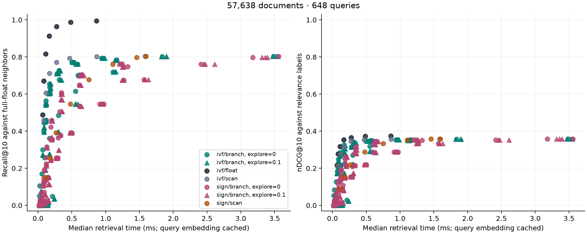

# Search results

57,638 documents, 648 queries.

The full selected dataset split was used.
Query embeddings are cached. Times include routing, the search call and float reranking.

| Method | Probes | Node budget | Explore | Seed | p50 ms | Float recall | nDCG |
|---|---:|---:|---:|---:|---:|---:|---:|
| ivf/float | 64 | 0 | 0 | 42 | 0.863 | 0.994 | 0.375 |
| ivf/float | 32 | 0 | 0 | 42 | 0.484 | 0.987 | 0.373 |
| ivf/float | 16 | 0 | 0 | 42 | 0.275 | 0.964 | 0.365 |
| ivf/float | 8 | 0 | 0 | 42 | 0.166 | 0.913 | 0.353 |
| ivf/float | 4 | 0 | 0 | 42 | 0.113 | 0.817 | 0.317 |
| ivf/scan | 64 | 0 | 0 | 42 | 1.586 | 0.804 | 0.358 |
| sign/scan | 120 | 0 | 0 | 42 | 1.596 | 0.804 | 0.358 |
| ivf/branch | 64 | 0 | 0.1 | 43 | 3.469 | 0.804 | 0.358 |
| ivf/branch | 64 | 0 | 0 | 42 | 3.486 | 0.804 | 0.358 |
| ivf/branch | 64 | 0 | 0.1 | 44 | 3.521 | 0.804 | 0.358 |
| ivf/branch | 64 | 0 | 0.1 | 42 | 3.552 | 0.804 | 0.358 |
| sign/branch | 120 | 0 | 0 | 42 | 3.559 | 0.804 | 0.358 |
| ivf/scan | 32 | 0 | 0 | 42 | 0.868 | 0.802 | 0.357 |
| ivf/branch | 32 | 0 | 0.1 | 43 | 1.825 | 0.802 | 0.357 |
| ivf/branch | 32 | 0 | 0 | 42 | 1.836 | 0.802 | 0.357 |
| ivf/branch | 32 | 0 | 0.1 | 42 | 1.899 | 0.802 | 0.357 |
| ivf/branch | 32 | 0 | 0.1 | 44 | 1.904 | 0.802 | 0.357 |
| sign/scan | 64 | 0 | 0 | 42 | 1.460 | 0.798 | 0.359 |
| sign/branch | 64 | 0 | 0 | 42 | 3.178 | 0.798 | 0.359 |
| sign/branch | 64 | 0 | 0.1 | 42 | 3.315 | 0.798 | 0.359 |
| sign/branch | 64 | 0 | 0.1 | 44 | 3.362 | 0.798 | 0.359 |
| sign/branch | 64 | 0 | 0.1 | 43 | 3.395 | 0.798 | 0.359 |
| ivf/scan | 16 | 0 | 0 | 42 | 0.468 | 0.793 | 0.354 |
| ivf/branch | 16 | 0 | 0 | 42 | 0.942 | 0.793 | 0.354 |
| ivf/branch | 16 | 0 | 0.1 | 43 | 0.951 | 0.793 | 0.354 |
| ivf/branch | 16 | 4096 | 0.1 | 43 | 0.958 | 0.793 | 0.354 |
| ivf/branch | 16 | 4096 | 0 | 42 | 0.961 | 0.793 | 0.354 |
| ivf/branch | 16 | 0 | 0.1 | 42 | 0.967 | 0.793 | 0.354 |
| ivf/branch | 16 | 4096 | 0.1 | 42 | 0.969 | 0.793 | 0.354 |
| ivf/branch | 16 | 4096 | 0.1 | 44 | 0.982 | 0.793 | 0.354 |
| ivf/branch | 16 | 0 | 0.1 | 44 | 0.987 | 0.793 | 0.354 |
| ivf/branch | 32 | 4096 | 0 | 42 | 1.161 | 0.785 | 0.354 |
| ivf/branch | 32 | 4096 | 0.1 | 42 | 1.136 | 0.784 | 0.354 |
| ivf/branch | 32 | 4096 | 0.1 | 43 | 1.138 | 0.783 | 0.354 |
| ivf/branch | 32 | 4096 | 0.1 | 44 | 1.173 | 0.782 | 0.354 |
| ivf/branch | 8 | 2048 | 0 | 42 | 0.503 | 0.771 | 0.346 |
| ivf/branch | 8 | 2048 | 0.1 | 43 | 0.506 | 0.771 | 0.346 |
| ivf/branch | 8 | 2048 | 0.1 | 44 | 0.511 | 0.771 | 0.346 |
| ivf/branch | 8 | 2048 | 0.1 | 42 | 0.546 | 0.771 | 0.346 |
| ivf/scan | 8 | 0 | 0 | 42 | 0.274 | 0.771 | 0.346 |
| ivf/branch | 8 | 0 | 0 | 42 | 0.503 | 0.771 | 0.346 |
| ivf/branch | 8 | 0 | 0.1 | 42 | 0.509 | 0.771 | 0.346 |
| ivf/branch | 8 | 4096 | 0.1 | 43 | 0.515 | 0.771 | 0.346 |
| ivf/branch | 8 | 4096 | 0 | 42 | 0.515 | 0.771 | 0.346 |
| ivf/branch | 8 | 0 | 0.1 | 44 | 0.518 | 0.771 | 0.346 |
| ivf/branch | 8 | 4096 | 0.1 | 44 | 0.522 | 0.771 | 0.346 |
| ivf/branch | 8 | 0 | 0.1 | 43 | 0.531 | 0.771 | 0.346 |
| ivf/branch | 8 | 4096 | 0.1 | 42 | 0.535 | 0.771 | 0.346 |
| sign/branch | 64 | 4096 | 0.1 | 44 | 1.260 | 0.764 | 0.354 |
| ivf/branch | 16 | 2048 | 0.1 | 44 | 0.555 | 0.763 | 0.351 |
| sign/branch | 64 | 4096 | 0 | 42 | 1.214 | 0.763 | 0.354 |
| ivf/branch | 16 | 2048 | 0.1 | 43 | 0.589 | 0.762 | 0.350 |
| sign/branch | 64 | 4096 | 0.1 | 42 | 1.240 | 0.762 | 0.354 |
| sign/branch | 64 | 4096 | 0.1 | 43 | 1.202 | 0.762 | 0.354 |
| sign/scan | 32 | 0 | 0 | 42 | 1.107 | 0.762 | 0.352 |
| sign/branch | 32 | 0 | 0 | 42 | 2.414 | 0.762 | 0.352 |
| sign/branch | 32 | 0 | 0.1 | 42 | 2.457 | 0.762 | 0.352 |
| sign/branch | 32 | 0 | 0.1 | 43 | 2.475 | 0.762 | 0.352 |
| sign/branch | 32 | 0 | 0.1 | 44 | 2.614 | 0.762 | 0.352 |
| ivf/branch | 16 | 2048 | 0 | 42 | 0.583 | 0.762 | 0.350 |
| ivf/branch | 16 | 2048 | 0.1 | 42 | 0.569 | 0.761 | 0.351 |
| sign/branch | 32 | 4096 | 0 | 42 | 1.326 | 0.748 | 0.352 |
| sign/branch | 32 | 4096 | 0.1 | 44 | 1.269 | 0.746 | 0.351 |
| sign/branch | 32 | 4096 | 0.1 | 43 | 1.256 | 0.746 | 0.351 |
| sign/branch | 32 | 4096 | 0.1 | 42 | 1.247 | 0.745 | 0.350 |
| ivf/branch | 8 | 1024 | 0 | 42 | 0.309 | 0.728 | 0.342 |
| ivf/branch | 8 | 1024 | 0.1 | 43 | 0.328 | 0.726 | 0.342 |
| ivf/branch | 8 | 1024 | 0.1 | 42 | 0.322 | 0.725 | 0.341 |
| ivf/branch | 8 | 1024 | 0.1 | 44 | 0.304 | 0.724 | 0.341 |
| ivf/branch | 64 | 4096 | 0.1 | 44 | 1.149 | 0.720 | 0.351 |
| ivf/branch | 64 | 4096 | 0.1 | 43 | 1.142 | 0.720 | 0.350 |
| ivf/branch | 64 | 4096 | 0.1 | 42 | 1.112 | 0.719 | 0.349 |
| ivf/branch | 64 | 4096 | 0 | 42 | 1.108 | 0.719 | 0.350 |
| ivf/scan | 4 | 0 | 0 | 42 | 0.170 | 0.712 | 0.314 |
| ivf/branch | 4 | 2048 | 0.1 | 43 | 0.281 | 0.712 | 0.314 |
| ivf/branch | 4 | 2048 | 0.1 | 42 | 0.287 | 0.712 | 0.314 |
| ivf/branch | 4 | 2048 | 0 | 42 | 0.288 | 0.712 | 0.314 |
| ivf/branch | 4 | 4096 | 0.1 | 44 | 0.289 | 0.712 | 0.314 |
| ivf/branch | 4 | 0 | 0.1 | 44 | 0.289 | 0.712 | 0.314 |
| ivf/branch | 4 | 4096 | 0 | 42 | 0.290 | 0.712 | 0.314 |
| ivf/branch | 4 | 0 | 0 | 42 | 0.291 | 0.712 | 0.314 |
| ivf/branch | 4 | 2048 | 0.1 | 44 | 0.294 | 0.712 | 0.314 |
| ivf/branch | 4 | 4096 | 0.1 | 42 | 0.298 | 0.712 | 0.314 |
| ivf/branch | 4 | 0 | 0.1 | 42 | 0.298 | 0.712 | 0.314 |
| ivf/branch | 4 | 0 | 0.1 | 43 | 0.299 | 0.712 | 0.314 |
| ivf/branch | 4 | 4096 | 0.1 | 43 | 0.306 | 0.712 | 0.314 |
| ivf/branch | 4 | 1024 | 0 | 42 | 0.282 | 0.710 | 0.314 |
| ivf/branch | 4 | 1024 | 0.1 | 42 | 0.275 | 0.710 | 0.314 |
| ivf/branch | 4 | 1024 | 0.1 | 44 | 0.279 | 0.710 | 0.314 |
| ivf/branch | 4 | 1024 | 0.1 | 43 | 0.284 | 0.710 | 0.314 |
| sign/branch | 64 | 2048 | 0 | 42 | 0.647 | 0.706 | 0.346 |
| ivf/branch | 32 | 2048 | 0.1 | 44 | 0.608 | 0.703 | 0.347 |
| ivf/branch | 32 | 2048 | 0.1 | 43 | 0.602 | 0.703 | 0.347 |
| ivf/branch | 32 | 2048 | 0.1 | 42 | 0.619 | 0.703 | 0.346 |
| ivf/branch | 32 | 2048 | 0 | 42 | 0.591 | 0.701 | 0.346 |
| sign/branch | 32 | 2048 | 0.1 | 43 | 0.657 | 0.701 | 0.344 |
| sign/branch | 32 | 2048 | 0 | 42 | 0.626 | 0.701 | 0.345 |
| sign/branch | 64 | 2048 | 0.1 | 42 | 0.625 | 0.700 | 0.345 |
| sign/branch | 32 | 2048 | 0.1 | 42 | 0.646 | 0.699 | 0.346 |
| sign/branch | 64 | 2048 | 0.1 | 44 | 0.680 | 0.699 | 0.344 |
| sign/branch | 64 | 2048 | 0.1 | 43 | 0.621 | 0.699 | 0.345 |
| sign/branch | 32 | 2048 | 0.1 | 44 | 0.613 | 0.698 | 0.344 |
| sign/scan | 16 | 0 | 0 | 42 | 0.752 | 0.678 | 0.334 |
| sign/branch | 16 | 0 | 0 | 42 | 1.568 | 0.678 | 0.334 |
| sign/branch | 16 | 0 | 0.1 | 43 | 1.577 | 0.678 | 0.334 |
| sign/branch | 16 | 0 | 0.1 | 42 | 1.585 | 0.678 | 0.334 |
| sign/branch | 16 | 0 | 0.1 | 44 | 1.632 | 0.678 | 0.334 |
| ivf/branch | 16 | 1024 | 0 | 42 | 0.315 | 0.678 | 0.338 |
| ivf/branch | 16 | 1024 | 0.1 | 43 | 0.327 | 0.676 | 0.337 |
| ivf/branch | 16 | 1024 | 0.1 | 42 | 0.330 | 0.676 | 0.336 |
| sign/branch | 16 | 4096 | 0.1 | 44 | 1.272 | 0.675 | 0.334 |
| ivf/branch | 16 | 1024 | 0.1 | 44 | 0.352 | 0.675 | 0.337 |
| sign/branch | 16 | 4096 | 0.1 | 42 | 1.243 | 0.675 | 0.334 |
| sign/branch | 16 | 4096 | 0 | 42 | 1.268 | 0.675 | 0.334 |
| sign/branch | 16 | 4096 | 0.1 | 43 | 1.252 | 0.675 | 0.334 |
| ivf/float | 2 | 0 | 0 | 42 | 0.084 | 0.671 | 0.278 |
| ivf/branch | 4 | 512 | 0.1 | 44 | 0.178 | 0.656 | 0.306 |
| ivf/branch | 4 | 512 | 0.1 | 43 | 0.188 | 0.656 | 0.304 |
| ivf/branch | 4 | 512 | 0.1 | 42 | 0.186 | 0.655 | 0.304 |
| ivf/branch | 4 | 512 | 0 | 42 | 0.169 | 0.655 | 0.304 |
| sign/branch | 16 | 2048 | 0.1 | 43 | 0.613 | 0.649 | 0.329 |
| sign/branch | 16 | 2048 | 0.1 | 44 | 0.633 | 0.649 | 0.328 |
| sign/branch | 16 | 2048 | 0 | 42 | 0.613 | 0.648 | 0.329 |
| sign/branch | 16 | 2048 | 0.1 | 42 | 0.636 | 0.648 | 0.329 |
| ivf/branch | 8 | 512 | 0 | 42 | 0.174 | 0.637 | 0.326 |
| ivf/branch | 8 | 512 | 0.1 | 42 | 0.182 | 0.632 | 0.321 |
| ivf/branch | 8 | 512 | 0.1 | 44 | 0.187 | 0.632 | 0.322 |
| ivf/branch | 8 | 512 | 0.1 | 43 | 0.190 | 0.630 | 0.322 |
| ivf/branch | 64 | 2048 | 0 | 42 | 0.555 | 0.616 | 0.319 |
| sign/branch | 32 | 1024 | 0 | 42 | 0.346 | 0.607 | 0.314 |
| ivf/scan | 2 | 0 | 0 | 42 | 0.116 | 0.606 | 0.276 |
| ivf/branch | 2 | 4096 | 0 | 42 | 0.170 | 0.606 | 0.276 |
| ivf/branch | 2 | 2048 | 0 | 42 | 0.171 | 0.606 | 0.276 |
| ivf/branch | 2 | 0 | 0 | 42 | 0.171 | 0.606 | 0.276 |
| ivf/branch | 2 | 0 | 0.1 | 42 | 0.173 | 0.606 | 0.276 |
| ivf/branch | 2 | 1024 | 0.1 | 42 | 0.173 | 0.606 | 0.276 |
| ivf/branch | 2 | 1024 | 0.1 | 44 | 0.174 | 0.606 | 0.276 |
| ivf/branch | 2 | 0 | 0.1 | 44 | 0.174 | 0.606 | 0.276 |
| ivf/branch | 2 | 4096 | 0.1 | 44 | 0.175 | 0.606 | 0.276 |
| ivf/branch | 2 | 1024 | 0 | 42 | 0.175 | 0.606 | 0.276 |
| ivf/branch | 2 | 2048 | 0.1 | 43 | 0.175 | 0.606 | 0.276 |
| ivf/branch | 2 | 4096 | 0.1 | 43 | 0.176 | 0.606 | 0.276 |
| ivf/branch | 2 | 2048 | 0.1 | 42 | 0.177 | 0.606 | 0.276 |
| ivf/branch | 2 | 2048 | 0.1 | 44 | 0.177 | 0.606 | 0.276 |
| ivf/branch | 2 | 4096 | 0.1 | 42 | 0.180 | 0.606 | 0.276 |
| ivf/branch | 2 | 1024 | 0.1 | 43 | 0.181 | 0.606 | 0.276 |
| ivf/branch | 2 | 0 | 0.1 | 43 | 0.182 | 0.606 | 0.276 |
| ivf/branch | 2 | 512 | 0 | 42 | 0.162 | 0.603 | 0.275 |
| ivf/branch | 2 | 512 | 0.1 | 43 | 0.161 | 0.602 | 0.275 |
| ivf/branch | 2 | 512 | 0.1 | 42 | 0.167 | 0.602 | 0.275 |
| ivf/branch | 2 | 512 | 0.1 | 44 | 0.162 | 0.602 | 0.275 |
| sign/branch | 16 | 1024 | 0 | 42 | 0.344 | 0.601 | 0.317 |
| sign/branch | 16 | 1024 | 0.1 | 44 | 0.358 | 0.600 | 0.316 |
| sign/branch | 16 | 1024 | 0.1 | 43 | 0.343 | 0.599 | 0.315 |
| sign/branch | 16 | 1024 | 0.1 | 42 | 0.342 | 0.599 | 0.316 |
| sign/branch | 32 | 1024 | 0.1 | 44 | 0.339 | 0.571 | 0.300 |
| sign/branch | 32 | 1024 | 0.1 | 42 | 0.345 | 0.569 | 0.298 |
| sign/branch | 32 | 1024 | 0.1 | 43 | 0.359 | 0.568 | 0.299 |
| ivf/branch | 4 | 256 | 0 | 42 | 0.118 | 0.564 | 0.285 |
| ivf/branch | 4 | 256 | 0.1 | 44 | 0.125 | 0.550 | 0.283 |
| ivf/branch | 4 | 256 | 0.1 | 43 | 0.125 | 0.549 | 0.283 |
| ivf/branch | 4 | 256 | 0.1 | 42 | 0.122 | 0.548 | 0.284 |
| ivf/branch | 64 | 2048 | 0.1 | 42 | 0.556 | 0.547 | 0.292 |
| ivf/branch | 64 | 2048 | 0.1 | 43 | 0.587 | 0.546 | 0.290 |
| sign/branch | 8 | 4096 | 0 | 42 | 0.913 | 0.546 | 0.288 |
| sign/branch | 8 | 4096 | 0.1 | 43 | 0.929 | 0.546 | 0.288 |
| sign/branch | 8 | 4096 | 0.1 | 44 | 0.942 | 0.546 | 0.288 |
| sign/branch | 8 | 4096 | 0.1 | 42 | 0.952 | 0.546 | 0.288 |
| sign/scan | 8 | 0 | 0 | 42 | 0.477 | 0.546 | 0.288 |
| sign/branch | 8 | 0 | 0.1 | 42 | 0.933 | 0.546 | 0.288 |
| sign/branch | 8 | 0 | 0.1 | 44 | 0.947 | 0.546 | 0.288 |
| sign/branch | 8 | 0 | 0.1 | 43 | 0.965 | 0.546 | 0.288 |
| sign/branch | 8 | 0 | 0 | 42 | 0.974 | 0.546 | 0.288 |
| ivf/branch | 64 | 2048 | 0.1 | 44 | 0.550 | 0.546 | 0.291 |
| ivf/branch | 2 | 256 | 0.1 | 43 | 0.115 | 0.543 | 0.267 |
| ivf/branch | 2 | 256 | 0 | 42 | 0.113 | 0.543 | 0.267 |
| ivf/branch | 2 | 256 | 0.1 | 44 | 0.115 | 0.541 | 0.268 |
| ivf/branch | 2 | 256 | 0.1 | 42 | 0.115 | 0.540 | 0.266 |
| sign/branch | 8 | 2048 | 0 | 42 | 0.608 | 0.536 | 0.287 |
| sign/branch | 8 | 2048 | 0.1 | 44 | 0.623 | 0.534 | 0.285 |
| sign/branch | 8 | 2048 | 0.1 | 43 | 0.631 | 0.534 | 0.285 |
| sign/branch | 8 | 2048 | 0.1 | 42 | 0.645 | 0.533 | 0.285 |
| sign/branch | 8 | 1024 | 0.1 | 42 | 0.352 | 0.507 | 0.279 |
| sign/branch | 8 | 1024 | 0.1 | 43 | 0.353 | 0.506 | 0.280 |
| sign/branch | 8 | 1024 | 0 | 42 | 0.323 | 0.506 | 0.280 |
| sign/branch | 8 | 1024 | 0.1 | 44 | 0.356 | 0.505 | 0.279 |
| ivf/float | 1 | 0 | 0 | 42 | 0.067 | 0.488 | 0.216 |
| ivf/branch | 32 | 1024 | 0 | 42 | 0.301 | 0.485 | 0.270 |
| sign/branch | 8 | 512 | 0 | 42 | 0.201 | 0.460 | 0.263 |
| ivf/scan | 1 | 0 | 0 | 42 | 0.085 | 0.459 | 0.215 |
| ivf/branch | 1 | 4096 | 0.1 | 43 | 0.111 | 0.459 | 0.215 |
| ivf/branch | 1 | 0 | 0.1 | 42 | 0.111 | 0.459 | 0.215 |
| ivf/branch | 1 | 4096 | 0 | 42 | 0.112 | 0.459 | 0.215 |
| ivf/branch | 1 | 0 | 0 | 42 | 0.112 | 0.459 | 0.215 |
| ivf/branch | 1 | 2048 | 0.1 | 43 | 0.112 | 0.459 | 0.215 |
| ivf/branch | 1 | 0 | 0.1 | 44 | 0.112 | 0.459 | 0.215 |
| ivf/branch | 1 | 0 | 0.1 | 43 | 0.112 | 0.459 | 0.215 |
| ivf/branch | 1 | 2048 | 0.1 | 42 | 0.113 | 0.459 | 0.215 |
| ivf/branch | 1 | 2048 | 0.1 | 44 | 0.113 | 0.459 | 0.215 |
| ivf/branch | 1 | 2048 | 0 | 42 | 0.113 | 0.459 | 0.215 |
| ivf/branch | 1 | 4096 | 0.1 | 42 | 0.114 | 0.459 | 0.215 |
| ivf/branch | 1 | 512 | 0.1 | 43 | 0.114 | 0.459 | 0.215 |
| ivf/branch | 1 | 1024 | 0.1 | 43 | 0.114 | 0.459 | 0.215 |
| ivf/branch | 1 | 512 | 0.1 | 44 | 0.115 | 0.459 | 0.215 |
| ivf/branch | 1 | 1024 | 0.1 | 42 | 0.115 | 0.459 | 0.215 |
| ivf/branch | 1 | 4096 | 0.1 | 44 | 0.115 | 0.459 | 0.215 |
| ivf/branch | 1 | 512 | 0.1 | 42 | 0.116 | 0.459 | 0.215 |
| ivf/branch | 1 | 1024 | 0 | 42 | 0.116 | 0.459 | 0.215 |
| ivf/branch | 1 | 1024 | 0.1 | 44 | 0.118 | 0.459 | 0.215 |
| ivf/branch | 1 | 512 | 0 | 42 | 0.119 | 0.459 | 0.215 |
| sign/branch | 8 | 512 | 0.1 | 43 | 0.210 | 0.455 | 0.261 |
| sign/branch | 8 | 512 | 0.1 | 42 | 0.188 | 0.455 | 0.260 |
| sign/branch | 8 | 512 | 0.1 | 44 | 0.215 | 0.454 | 0.261 |
| ivf/branch | 1 | 256 | 0 | 42 | 0.110 | 0.450 | 0.212 |
| ivf/branch | 1 | 256 | 0.1 | 44 | 0.107 | 0.450 | 0.210 |
| ivf/branch | 1 | 256 | 0.1 | 43 | 0.108 | 0.450 | 0.210 |
| ivf/branch | 1 | 256 | 0.1 | 42 | 0.110 | 0.450 | 0.210 |
| ivf/branch | 2 | 128 | 0 | 42 | 0.089 | 0.444 | 0.249 |
| sign/branch | 16 | 512 | 0 | 42 | 0.189 | 0.422 | 0.249 |
| ivf/branch | 2 | 128 | 0.1 | 44 | 0.089 | 0.421 | 0.241 |
| ivf/branch | 2 | 128 | 0.1 | 42 | 0.091 | 0.419 | 0.241 |
| ivf/branch | 2 | 128 | 0.1 | 43 | 0.086 | 0.418 | 0.241 |
| ivf/branch | 1 | 128 | 0 | 42 | 0.085 | 0.397 | 0.203 |
| ivf/branch | 32 | 1024 | 0.1 | 42 | 0.303 | 0.397 | 0.224 |
| ivf/branch | 1 | 128 | 0.1 | 42 | 0.087 | 0.396 | 0.205 |
| ivf/branch | 1 | 128 | 0.1 | 43 | 0.087 | 0.396 | 0.203 |
| ivf/branch | 32 | 1024 | 0.1 | 44 | 0.292 | 0.396 | 0.219 |
| ivf/branch | 32 | 1024 | 0.1 | 43 | 0.305 | 0.395 | 0.218 |
| ivf/branch | 1 | 128 | 0.1 | 44 | 0.087 | 0.395 | 0.204 |
| sign/scan | 4 | 0 | 0 | 42 | 0.265 | 0.391 | 0.220 |
| sign/branch | 4 | 0 | 0.1 | 44 | 0.474 | 0.391 | 0.220 |
| sign/branch | 4 | 4096 | 0.1 | 42 | 0.481 | 0.391 | 0.220 |
| sign/branch | 4 | 4096 | 0 | 42 | 0.482 | 0.391 | 0.220 |
| sign/branch | 4 | 0 | 0.1 | 43 | 0.493 | 0.391 | 0.220 |
| sign/branch | 4 | 0 | 0.1 | 42 | 0.496 | 0.391 | 0.220 |
| sign/branch | 4 | 4096 | 0.1 | 43 | 0.498 | 0.391 | 0.220 |
| sign/branch | 4 | 0 | 0 | 42 | 0.498 | 0.391 | 0.220 |
| sign/branch | 4 | 4096 | 0.1 | 44 | 0.501 | 0.391 | 0.220 |
| sign/branch | 4 | 2048 | 0.1 | 43 | 0.497 | 0.390 | 0.220 |
| sign/branch | 4 | 2048 | 0.1 | 44 | 0.475 | 0.390 | 0.220 |
| sign/branch | 4 | 2048 | 0.1 | 42 | 0.497 | 0.390 | 0.220 |
| sign/branch | 4 | 2048 | 0 | 42 | 0.502 | 0.390 | 0.220 |
| sign/branch | 4 | 1024 | 0.1 | 43 | 0.320 | 0.378 | 0.215 |
| sign/branch | 4 | 1024 | 0.1 | 44 | 0.330 | 0.378 | 0.216 |
| sign/branch | 4 | 1024 | 0 | 42 | 0.336 | 0.378 | 0.215 |
| sign/branch | 4 | 1024 | 0.1 | 42 | 0.334 | 0.378 | 0.216 |
| sign/branch | 16 | 512 | 0.1 | 42 | 0.205 | 0.367 | 0.227 |
| sign/branch | 64 | 1024 | 0 | 42 | 0.298 | 0.363 | 0.209 |
| sign/branch | 16 | 512 | 0.1 | 44 | 0.194 | 0.363 | 0.228 |
| sign/branch | 16 | 512 | 0.1 | 43 | 0.181 | 0.362 | 0.224 |
| ivf/branch | 16 | 512 | 0 | 42 | 0.170 | 0.361 | 0.223 |
| sign/branch | 4 | 512 | 0.1 | 44 | 0.199 | 0.355 | 0.211 |
| sign/branch | 4 | 512 | 0.1 | 42 | 0.196 | 0.355 | 0.212 |
| sign/branch | 4 | 512 | 0 | 42 | 0.208 | 0.355 | 0.210 |
| sign/branch | 4 | 512 | 0.1 | 43 | 0.208 | 0.354 | 0.210 |
| sign/branch | 4 | 256 | 0 | 42 | 0.128 | 0.315 | 0.191 |
| sign/branch | 4 | 256 | 0.1 | 44 | 0.136 | 0.311 | 0.191 |
| sign/branch | 4 | 256 | 0.1 | 43 | 0.130 | 0.311 | 0.192 |
| sign/branch | 4 | 256 | 0.1 | 42 | 0.130 | 0.310 | 0.190 |
| ivf/branch | 1 | 64 | 0 | 42 | 0.070 | 0.300 | 0.183 |
| sign/branch | 64 | 1024 | 0.1 | 42 | 0.307 | 0.299 | 0.174 |
| sign/branch | 64 | 1024 | 0.1 | 44 | 0.307 | 0.298 | 0.175 |
| sign/branch | 64 | 1024 | 0.1 | 43 | 0.308 | 0.297 | 0.172 |
| ivf/branch | 16 | 512 | 0.1 | 43 | 0.167 | 0.277 | 0.171 |
| ivf/branch | 16 | 512 | 0.1 | 42 | 0.174 | 0.276 | 0.175 |
| ivf/branch | 16 | 512 | 0.1 | 44 | 0.175 | 0.274 | 0.168 |
| ivf/branch | 1 | 64 | 0.1 | 44 | 0.068 | 0.273 | 0.176 |
| ivf/branch | 1 | 64 | 0.1 | 42 | 0.072 | 0.273 | 0.174 |
| ivf/branch | 1 | 64 | 0.1 | 43 | 0.068 | 0.270 | 0.172 |
| ivf/branch | 8 | 256 | 0 | 42 | 0.097 | 0.258 | 0.179 |
| sign/branch | 8 | 256 | 0 | 42 | 0.121 | 0.257 | 0.187 |
| sign/scan | 2 | 0 | 0 | 42 | 0.177 | 0.256 | 0.154 |
| sign/branch | 2 | 0 | 0 | 42 | 0.270 | 0.256 | 0.154 |
| sign/branch | 2 | 2048 | 0.1 | 43 | 0.271 | 0.256 | 0.154 |
| sign/branch | 2 | 4096 | 0.1 | 43 | 0.278 | 0.256 | 0.154 |
| sign/branch | 2 | 0 | 0.1 | 44 | 0.278 | 0.256 | 0.154 |
| sign/branch | 2 | 4096 | 0.1 | 42 | 0.278 | 0.256 | 0.154 |
| sign/branch | 2 | 2048 | 0.1 | 44 | 0.280 | 0.256 | 0.154 |
| sign/branch | 2 | 4096 | 0.1 | 44 | 0.281 | 0.256 | 0.154 |
| sign/branch | 2 | 0 | 0.1 | 43 | 0.281 | 0.256 | 0.154 |
| sign/branch | 2 | 2048 | 0.1 | 42 | 0.283 | 0.256 | 0.154 |
| sign/branch | 2 | 2048 | 0 | 42 | 0.283 | 0.256 | 0.154 |
| sign/branch | 2 | 0 | 0.1 | 42 | 0.288 | 0.256 | 0.154 |
| sign/branch | 2 | 4096 | 0 | 42 | 0.292 | 0.256 | 0.154 |
| sign/branch | 2 | 1024 | 0.1 | 43 | 0.285 | 0.254 | 0.153 |
| sign/branch | 2 | 1024 | 0.1 | 44 | 0.291 | 0.254 | 0.153 |
| sign/branch | 2 | 1024 | 0 | 42 | 0.275 | 0.254 | 0.153 |
| sign/branch | 2 | 1024 | 0.1 | 42 | 0.277 | 0.254 | 0.153 |
| sign/branch | 2 | 512 | 0.1 | 44 | 0.185 | 0.244 | 0.149 |
| sign/branch | 2 | 512 | 0 | 42 | 0.192 | 0.244 | 0.149 |
| sign/branch | 2 | 512 | 0.1 | 42 | 0.188 | 0.244 | 0.148 |
| sign/branch | 2 | 512 | 0.1 | 43 | 0.186 | 0.243 | 0.148 |
| sign/branch | 2 | 256 | 0 | 42 | 0.119 | 0.223 | 0.143 |
| sign/branch | 2 | 256 | 0.1 | 42 | 0.124 | 0.223 | 0.142 |
| sign/branch | 2 | 256 | 0.1 | 44 | 0.123 | 0.223 | 0.142 |
| sign/branch | 2 | 256 | 0.1 | 43 | 0.125 | 0.222 | 0.142 |
| sign/branch | 8 | 256 | 0.1 | 42 | 0.122 | 0.213 | 0.168 |
| sign/branch | 8 | 256 | 0.1 | 43 | 0.127 | 0.213 | 0.166 |
| sign/branch | 8 | 256 | 0.1 | 44 | 0.122 | 0.213 | 0.167 |
| sign/branch | 2 | 128 | 0 | 42 | 0.092 | 0.193 | 0.132 |
| ivf/branch | 8 | 256 | 0.1 | 44 | 0.109 | 0.192 | 0.137 |
| ivf/branch | 8 | 256 | 0.1 | 42 | 0.109 | 0.190 | 0.139 |
| sign/branch | 2 | 128 | 0.1 | 42 | 0.096 | 0.190 | 0.130 |
| ivf/branch | 8 | 256 | 0.1 | 43 | 0.103 | 0.190 | 0.135 |
| sign/branch | 2 | 128 | 0.1 | 44 | 0.093 | 0.189 | 0.129 |
| sign/branch | 2 | 128 | 0.1 | 43 | 0.096 | 0.188 | 0.130 |
| ivf/branch | 4 | 128 | 0 | 42 | 0.057 | 0.170 | 0.128 |
| sign/scan | 1 | 0 | 0 | 42 | 0.106 | 0.151 | 0.090 |
| sign/branch | 1 | 1024 | 0 | 42 | 0.141 | 0.151 | 0.090 |
| sign/branch | 1 | 0 | 0.1 | 44 | 0.142 | 0.151 | 0.090 |
| sign/branch | 1 | 2048 | 0.1 | 44 | 0.143 | 0.151 | 0.090 |
| sign/branch | 1 | 1024 | 0.1 | 44 | 0.144 | 0.151 | 0.090 |
| sign/branch | 1 | 0 | 0.1 | 42 | 0.144 | 0.151 | 0.090 |
| sign/branch | 1 | 0 | 0 | 42 | 0.147 | 0.151 | 0.090 |
| sign/branch | 1 | 4096 | 0.1 | 42 | 0.147 | 0.151 | 0.090 |
| sign/branch | 1 | 4096 | 0 | 42 | 0.148 | 0.151 | 0.090 |
| sign/branch | 1 | 2048 | 0.1 | 43 | 0.148 | 0.151 | 0.090 |
| sign/branch | 1 | 2048 | 0 | 42 | 0.149 | 0.151 | 0.090 |
| sign/branch | 1 | 1024 | 0.1 | 43 | 0.149 | 0.151 | 0.090 |
| sign/branch | 1 | 1024 | 0.1 | 42 | 0.150 | 0.151 | 0.090 |
| sign/branch | 1 | 0 | 0.1 | 43 | 0.154 | 0.151 | 0.090 |
| sign/branch | 1 | 2048 | 0.1 | 42 | 0.156 | 0.151 | 0.090 |
| sign/branch | 1 | 4096 | 0.1 | 44 | 0.158 | 0.151 | 0.090 |
| sign/branch | 1 | 4096 | 0.1 | 43 | 0.162 | 0.151 | 0.090 |
| sign/branch | 1 | 512 | 0.1 | 43 | 0.143 | 0.149 | 0.091 |
| sign/branch | 1 | 512 | 0.1 | 44 | 0.141 | 0.149 | 0.091 |
| sign/branch | 1 | 512 | 0 | 42 | 0.141 | 0.149 | 0.091 |
| sign/branch | 1 | 512 | 0.1 | 42 | 0.147 | 0.149 | 0.091 |
| sign/branch | 32 | 512 | 0 | 42 | 0.155 | 0.149 | 0.108 |
| sign/branch | 4 | 128 | 0 | 42 | 0.084 | 0.144 | 0.116 |
| sign/branch | 1 | 256 | 0.1 | 42 | 0.116 | 0.139 | 0.087 |
| sign/branch | 1 | 256 | 0.1 | 44 | 0.121 | 0.139 | 0.088 |
| sign/branch | 1 | 256 | 0 | 42 | 0.114 | 0.138 | 0.087 |
| sign/branch | 1 | 256 | 0.1 | 43 | 0.119 | 0.138 | 0.087 |
| sign/branch | 1 | 128 | 0 | 42 | 0.086 | 0.127 | 0.085 |
| sign/branch | 1 | 128 | 0.1 | 44 | 0.092 | 0.127 | 0.085 |
| sign/branch | 1 | 128 | 0.1 | 43 | 0.090 | 0.126 | 0.085 |
| ivf/branch | 4 | 128 | 0.1 | 43 | 0.076 | 0.126 | 0.091 |
| ivf/branch | 4 | 128 | 0.1 | 44 | 0.078 | 0.126 | 0.095 |
| sign/branch | 1 | 128 | 0.1 | 42 | 0.096 | 0.126 | 0.084 |
| ivf/branch | 4 | 128 | 0.1 | 42 | 0.075 | 0.124 | 0.092 |
| sign/branch | 32 | 512 | 0.1 | 42 | 0.169 | 0.114 | 0.083 |
| sign/branch | 4 | 128 | 0.1 | 42 | 0.083 | 0.113 | 0.091 |
| sign/branch | 32 | 512 | 0.1 | 44 | 0.154 | 0.113 | 0.084 |
| sign/branch | 4 | 128 | 0.1 | 43 | 0.084 | 0.113 | 0.090 |
| sign/branch | 32 | 512 | 0.1 | 43 | 0.164 | 0.112 | 0.080 |
| sign/branch | 4 | 128 | 0.1 | 44 | 0.087 | 0.111 | 0.088 |
| sign/branch | 1 | 64 | 0 | 42 | 0.073 | 0.111 | 0.084 |
| sign/branch | 1 | 64 | 0.1 | 43 | 0.076 | 0.107 | 0.082 |
| sign/branch | 1 | 64 | 0.1 | 42 | 0.074 | 0.106 | 0.083 |
| sign/branch | 1 | 64 | 0.1 | 44 | 0.075 | 0.106 | 0.082 |
| ivf/branch | 2 | 64 | 0 | 42 | 0.026 | 0.105 | 0.084 |
| ivf/branch | 2 | 64 | 0.1 | 43 | 0.046 | 0.079 | 0.058 |
| ivf/branch | 2 | 64 | 0.1 | 44 | 0.048 | 0.076 | 0.066 |
| ivf/branch | 2 | 64 | 0.1 | 42 | 0.047 | 0.075 | 0.062 |
| sign/branch | 16 | 256 | 0 | 42 | 0.087 | 0.072 | 0.060 |
| sign/branch | 2 | 64 | 0 | 42 | 0.050 | 0.067 | 0.060 |
| sign/branch | 16 | 256 | 0.1 | 44 | 0.104 | 0.058 | 0.045 |
| sign/branch | 16 | 256 | 0.1 | 43 | 0.110 | 0.057 | 0.047 |
| sign/branch | 16 | 256 | 0.1 | 42 | 0.107 | 0.057 | 0.048 |
| ivf/branch | 1 | 32 | 0 | 42 | 0.019 | 0.051 | 0.053 |
| sign/branch | 2 | 64 | 0.1 | 44 | 0.053 | 0.050 | 0.044 |
| sign/branch | 2 | 64 | 0.1 | 42 | 0.055 | 0.050 | 0.045 |
| ivf/branch | 64 | 1024 | 0 | 42 | 0.212 | 0.049 | 0.029 |
| sign/branch | 2 | 64 | 0.1 | 43 | 0.052 | 0.048 | 0.045 |
| ivf/branch | 1 | 32 | 0.1 | 42 | 0.034 | 0.037 | 0.038 |
| ivf/branch | 1 | 32 | 0.1 | 44 | 0.031 | 0.036 | 0.039 |
| sign/branch | 8 | 128 | 0 | 42 | 0.044 | 0.035 | 0.035 |
| ivf/branch | 64 | 1024 | 0.1 | 42 | 0.240 | 0.035 | 0.023 |
| ivf/branch | 64 | 1024 | 0.1 | 44 | 0.241 | 0.035 | 0.023 |
| ivf/branch | 1 | 32 | 0.1 | 43 | 0.031 | 0.035 | 0.029 |
| ivf/branch | 64 | 1024 | 0.1 | 43 | 0.235 | 0.035 | 0.024 |
| sign/branch | 64 | 512 | 0 | 42 | 0.136 | 0.031 | 0.019 |
| sign/branch | 1 | 32 | 0 | 42 | 0.029 | 0.029 | 0.027 |
| sign/branch | 8 | 128 | 0.1 | 43 | 0.071 | 0.029 | 0.032 |
| sign/branch | 8 | 128 | 0.1 | 42 | 0.073 | 0.028 | 0.029 |
| sign/branch | 8 | 128 | 0.1 | 44 | 0.067 | 0.028 | 0.030 |
| sign/branch | 64 | 512 | 0.1 | 42 | 0.156 | 0.026 | 0.017 |
| sign/branch | 64 | 512 | 0.1 | 43 | 0.153 | 0.026 | 0.017 |
| sign/branch | 64 | 512 | 0.1 | 44 | 0.152 | 0.025 | 0.016 |
| ivf/branch | 32 | 512 | 0 | 42 | 0.094 | 0.023 | 0.013 |
| sign/branch | 1 | 32 | 0.1 | 42 | 0.037 | 0.022 | 0.020 |
| sign/branch | 1 | 32 | 0.1 | 43 | 0.036 | 0.021 | 0.017 |
| sign/branch | 1 | 32 | 0.1 | 44 | 0.038 | 0.020 | 0.018 |
| sign/branch | 32 | 256 | 0 | 42 | 0.089 | 0.019 | 0.016 |
| sign/branch | 4 | 64 | 0 | 42 | 0.027 | 0.018 | 0.016 |
| sign/branch | 32 | 256 | 0.1 | 43 | 0.101 | 0.017 | 0.015 |
| sign/branch | 32 | 256 | 0.1 | 42 | 0.102 | 0.017 | 0.014 |
| sign/branch | 32 | 256 | 0.1 | 44 | 0.100 | 0.016 | 0.015 |
| sign/branch | 4 | 64 | 0.1 | 42 | 0.044 | 0.015 | 0.014 |
| sign/branch | 4 | 64 | 0.1 | 44 | 0.042 | 0.015 | 0.012 |
| sign/branch | 4 | 64 | 0.1 | 43 | 0.043 | 0.015 | 0.013 |
| ivf/branch | 32 | 512 | 0.1 | 43 | 0.154 | 0.015 | 0.009 |
| ivf/branch | 32 | 512 | 0.1 | 44 | 0.149 | 0.014 | 0.010 |
| ivf/branch | 32 | 512 | 0.1 | 42 | 0.155 | 0.014 | 0.010 |
| sign/branch | 16 | 128 | 0 | 42 | 0.045 | 0.012 | 0.013 |
| ivf/branch | 16 | 256 | 0 | 42 | 0.050 | 0.012 | 0.008 |
| sign/branch | 16 | 128 | 0.1 | 43 | 0.070 | 0.010 | 0.011 |
| sign/branch | 16 | 128 | 0.1 | 44 | 0.067 | 0.010 | 0.012 |
| sign/branch | 64 | 256 | 0 | 42 | 0.090 | 0.009 | 0.010 |
| sign/branch | 64 | 256 | 0.1 | 43 | 0.091 | 0.009 | 0.011 |
| sign/branch | 16 | 128 | 0.1 | 42 | 0.065 | 0.008 | 0.010 |
| sign/branch | 64 | 256 | 0.1 | 42 | 0.095 | 0.008 | 0.010 |
| sign/branch | 64 | 256 | 0.1 | 44 | 0.102 | 0.008 | 0.011 |
| ivf/branch | 16 | 256 | 0.1 | 44 | 0.101 | 0.008 | 0.005 |
| ivf/branch | 8 | 128 | 0 | 42 | 0.031 | 0.008 | 0.007 |
| ivf/branch | 16 | 256 | 0.1 | 43 | 0.097 | 0.008 | 0.005 |
| sign/branch | 8 | 64 | 0 | 42 | 0.026 | 0.008 | 0.010 |
| ivf/branch | 16 | 256 | 0.1 | 42 | 0.102 | 0.008 | 0.006 |
| sign/branch | 2 | 32 | 0 | 42 | 0.021 | 0.007 | 0.006 |
| sign/branch | 2 | 32 | 0.1 | 44 | 0.027 | 0.007 | 0.005 |
| sign/branch | 32 | 128 | 0 | 42 | 0.056 | 0.007 | 0.010 |
| sign/branch | 2 | 32 | 0.1 | 43 | 0.029 | 0.006 | 0.004 |
| ivf/branch | 8 | 128 | 0.1 | 44 | 0.060 | 0.006 | 0.006 |
| sign/branch | 32 | 128 | 0.1 | 44 | 0.069 | 0.006 | 0.010 |
| sign/branch | 64 | 128 | 0.1 | 44 | 0.069 | 0.006 | 0.009 |
| sign/branch | 32 | 128 | 0.1 | 43 | 0.070 | 0.006 | 0.010 |
| sign/branch | 2 | 32 | 0.1 | 42 | 0.028 | 0.006 | 0.004 |
| ivf/branch | 8 | 128 | 0.1 | 43 | 0.063 | 0.006 | 0.005 |
| sign/branch | 32 | 128 | 0.1 | 42 | 0.067 | 0.006 | 0.010 |
| sign/branch | 8 | 64 | 0.1 | 42 | 0.039 | 0.006 | 0.005 |
| sign/branch | 64 | 128 | 0 | 42 | 0.067 | 0.006 | 0.009 |
| sign/branch | 64 | 128 | 0.1 | 42 | 0.070 | 0.006 | 0.009 |
| sign/branch | 64 | 128 | 0.1 | 43 | 0.071 | 0.006 | 0.009 |
| sign/branch | 8 | 64 | 0.1 | 43 | 0.040 | 0.005 | 0.007 |
| sign/branch | 64 | 64 | 0 | 42 | 0.056 | 0.005 | 0.008 |
| sign/branch | 64 | 64 | 0.1 | 42 | 0.058 | 0.005 | 0.008 |
| ivf/branch | 8 | 128 | 0.1 | 42 | 0.058 | 0.005 | 0.004 |
| sign/branch | 64 | 64 | 0.1 | 43 | 0.057 | 0.005 | 0.008 |
| sign/branch | 64 | 64 | 0.1 | 44 | 0.058 | 0.005 | 0.008 |
| sign/branch | 8 | 64 | 0.1 | 44 | 0.040 | 0.005 | 0.005 |
| ivf/branch | 4 | 64 | 0 | 42 | 0.023 | 0.004 | 0.003 |
| sign/branch | 16 | 64 | 0 | 42 | 0.031 | 0.004 | 0.007 |
| ivf/branch | 4 | 64 | 0.1 | 43 | 0.039 | 0.004 | 0.005 |
| sign/branch | 32 | 32 | 0 | 42 | 0.038 | 0.004 | 0.007 |
| sign/branch | 64 | 32 | 0.1 | 43 | 0.040 | 0.004 | 0.007 |
| sign/branch | 16 | 64 | 0.1 | 42 | 0.040 | 0.004 | 0.006 |
| sign/branch | 16 | 64 | 0.1 | 43 | 0.041 | 0.004 | 0.007 |
| sign/branch | 64 | 32 | 0.1 | 44 | 0.041 | 0.004 | 0.007 |
| sign/branch | 64 | 32 | 0 | 42 | 0.041 | 0.004 | 0.007 |
| sign/branch | 16 | 64 | 0.1 | 44 | 0.042 | 0.004 | 0.006 |
| sign/branch | 32 | 64 | 0 | 42 | 0.043 | 0.004 | 0.007 |
| sign/branch | 32 | 64 | 0.1 | 42 | 0.046 | 0.004 | 0.007 |
| sign/branch | 32 | 64 | 0.1 | 44 | 0.046 | 0.004 | 0.007 |
| sign/branch | 32 | 64 | 0.1 | 43 | 0.047 | 0.004 | 0.007 |
| sign/branch | 1 | 16 | 0 | 42 | 0.018 | 0.004 | 0.003 |
| sign/branch | 32 | 32 | 0.1 | 44 | 0.036 | 0.004 | 0.007 |
| sign/branch | 32 | 32 | 0.1 | 43 | 0.036 | 0.004 | 0.007 |
| sign/branch | 32 | 32 | 0.1 | 42 | 0.037 | 0.004 | 0.007 |
| ivf/branch | 4 | 64 | 0.1 | 44 | 0.039 | 0.004 | 0.004 |
| ivf/branch | 4 | 64 | 0.1 | 42 | 0.039 | 0.004 | 0.002 |
| sign/branch | 64 | 32 | 0.1 | 42 | 0.041 | 0.004 | 0.007 |
| sign/branch | 1 | 16 | 0.1 | 44 | 0.021 | 0.003 | 0.003 |
| sign/branch | 1 | 16 | 0.1 | 43 | 0.021 | 0.003 | 0.003 |
| sign/branch | 4 | 32 | 0 | 42 | 0.021 | 0.003 | 0.003 |
| sign/branch | 1 | 16 | 0.1 | 42 | 0.021 | 0.003 | 0.003 |
| sign/branch | 4 | 32 | 0.1 | 42 | 0.027 | 0.003 | 0.003 |
| ivf/branch | 2 | 32 | 0.1 | 42 | 0.026 | 0.003 | 0.002 |
| ivf/branch | 2 | 32 | 0 | 42 | 0.018 | 0.003 | 0.002 |
| sign/branch | 4 | 32 | 0.1 | 44 | 0.025 | 0.003 | 0.003 |
| ivf/branch | 2 | 32 | 0.1 | 43 | 0.028 | 0.003 | 0.002 |
| sign/branch | 16 | 16 | 0.1 | 42 | 0.020 | 0.003 | 0.005 |
| sign/branch | 16 | 16 | 0 | 42 | 0.020 | 0.003 | 0.005 |
| sign/branch | 16 | 16 | 0.1 | 44 | 0.020 | 0.003 | 0.005 |
| sign/branch | 32 | 16 | 0 | 42 | 0.021 | 0.003 | 0.005 |
| sign/branch | 32 | 16 | 0.1 | 42 | 0.023 | 0.003 | 0.005 |
| sign/branch | 32 | 16 | 0.1 | 44 | 0.023 | 0.003 | 0.006 |
| sign/branch | 16 | 32 | 0 | 42 | 0.023 | 0.003 | 0.005 |
| sign/branch | 64 | 16 | 0 | 42 | 0.024 | 0.003 | 0.005 |
| sign/branch | 16 | 32 | 0.1 | 44 | 0.025 | 0.003 | 0.005 |
| sign/branch | 16 | 32 | 0.1 | 43 | 0.027 | 0.003 | 0.005 |
| sign/branch | 16 | 32 | 0.1 | 42 | 0.027 | 0.003 | 0.005 |
| sign/branch | 64 | 16 | 0.1 | 42 | 0.029 | 0.003 | 0.005 |
| ivf/branch | 2 | 32 | 0.1 | 44 | 0.026 | 0.003 | 0.003 |
| sign/branch | 16 | 16 | 0.1 | 43 | 0.020 | 0.002 | 0.005 |
| sign/branch | 4 | 32 | 0.1 | 43 | 0.027 | 0.002 | 0.002 |
| sign/branch | 64 | 16 | 0.1 | 44 | 0.027 | 0.002 | 0.005 |
| ivf/branch | 1 | 16 | 0.1 | 43 | 0.021 | 0.002 | 0.002 |
| sign/branch | 32 | 16 | 0.1 | 43 | 0.022 | 0.002 | 0.005 |
| ivf/branch | 1 | 16 | 0 | 42 | 0.016 | 0.002 | 0.002 |
| ivf/branch | 1 | 16 | 0.1 | 44 | 0.021 | 0.002 | 0.003 |
| ivf/branch | 1 | 16 | 0.1 | 42 | 0.021 | 0.002 | 0.003 |
| sign/branch | 64 | 16 | 0.1 | 43 | 0.027 | 0.002 | 0.005 |
| sign/branch | 8 | 32 | 0 | 42 | 0.021 | 0.002 | 0.003 |
| sign/branch | 8 | 32 | 0.1 | 42 | 0.026 | 0.002 | 0.003 |
| sign/branch | 8 | 32 | 0.1 | 43 | 0.025 | 0.002 | 0.003 |
| sign/branch | 8 | 32 | 0.1 | 44 | 0.026 | 0.002 | 0.003 |
| sign/branch | 2 | 16 | 0 | 42 | 0.018 | 0.001 | 0.000 |
| sign/branch | 2 | 16 | 0.1 | 42 | 0.019 | 0.001 | 0.000 |
| ivf/branch | 64 | 512 | 0 | 42 | 0.095 | 0.001 | 0.000 |
| sign/branch | 2 | 16 | 0.1 | 43 | 0.020 | 0.001 | 0.000 |
| sign/branch | 8 | 16 | 0.1 | 42 | 0.019 | 0.001 | 0.003 |
| sign/branch | 8 | 16 | 0.1 | 43 | 0.019 | 0.001 | 0.003 |
| sign/branch | 8 | 16 | 0 | 42 | 0.019 | 0.001 | 0.003 |
| sign/branch | 8 | 16 | 0.1 | 44 | 0.019 | 0.001 | 0.003 |
| sign/branch | 2 | 16 | 0.1 | 44 | 0.020 | 0.001 | 0.000 |
| ivf/branch | 64 | 512 | 0.1 | 42 | 0.144 | 0.001 | 0.000 |
| ivf/branch | 64 | 512 | 0.1 | 43 | 0.147 | 0.001 | 0.000 |
| ivf/branch | 16 | 128 | 0.1 | 44 | 0.056 | 0.001 | 0.000 |
| sign/branch | 4 | 16 | 0 | 42 | 0.018 | 0.000 | 0.000 |
| sign/branch | 4 | 16 | 0.1 | 44 | 0.019 | 0.000 | 0.000 |
| sign/branch | 4 | 16 | 0.1 | 43 | 0.019 | 0.000 | 0.000 |
| sign/branch | 4 | 16 | 0.1 | 42 | 0.019 | 0.000 | 0.000 |
| ivf/branch | 32 | 256 | 0.1 | 43 | 0.089 | 0.000 | 0.000 |
| ivf/branch | 32 | 256 | 0.1 | 44 | 0.093 | 0.000 | 0.001 |
| ivf/branch | 64 | 512 | 0.1 | 44 | 0.148 | 0.000 | 0.001 |
| ivf/branch | 4 | 32 | 0.1 | 42 | 0.025 | 0.000 | 0.000 |
| ivf/branch | 16 | 64 | 0.1 | 44 | 0.032 | 0.000 | 0.000 |
| ivf/branch | 8 | 64 | 0.1 | 43 | 0.036 | 0.000 | 0.000 |
| ivf/branch | 16 | 128 | 0.1 | 43 | 0.056 | 0.000 | 0.000 |
| ivf/branch | 16 | 128 | 0.1 | 42 | 0.057 | 0.000 | 0.000 |
| ivf/branch | 32 | 256 | 0.1 | 42 | 0.092 | 0.000 | 0.000 |
| ivf/branch | 2 | 16 | 0.1 | 42 | 0.019 | 0.000 | 0.000 |
| ivf/branch | 8 | 64 | 0 | 42 | 0.022 | 0.000 | 0.000 |
| ivf/branch | 4 | 32 | 0.1 | 44 | 0.025 | 0.000 | 0.000 |
| ivf/branch | 32 | 64 | 0.1 | 44 | 0.027 | 0.000 | 0.000 |
| ivf/branch | 16 | 128 | 0 | 42 | 0.032 | 0.000 | 0.000 |
| ivf/branch | 8 | 64 | 0.1 | 42 | 0.035 | 0.000 | 0.001 |
| ivf/branch | 8 | 64 | 0.1 | 44 | 0.036 | 0.000 | 0.000 |
| ivf/branch | 32 | 128 | 0.1 | 44 | 0.049 | 0.000 | 0.000 |
| ivf/branch | 32 | 128 | 0.1 | 42 | 0.049 | 0.000 | 0.000 |
| ivf/branch | 32 | 256 | 0 | 42 | 0.052 | 0.000 | 0.000 |
| ivf/branch | 64 | 256 | 0.1 | 44 | 0.079 | 0.000 | 0.000 |
| ivf/branch | 4 | 16 | 0 | 42 | 0.017 | 0.000 | 0.000 |
| ivf/branch | 8 | 16 | 0.1 | 42 | 0.017 | 0.000 | 0.000 |
| ivf/branch | 8 | 16 | 0 | 42 | 0.017 | 0.000 | 0.000 |
| ivf/branch | 8 | 16 | 0.1 | 44 | 0.017 | 0.000 | 0.000 |
| ivf/branch | 2 | 16 | 0 | 42 | 0.017 | 0.000 | 0.000 |
| ivf/branch | 8 | 16 | 0.1 | 43 | 0.018 | 0.000 | 0.000 |
| ivf/branch | 16 | 16 | 0 | 42 | 0.018 | 0.000 | 0.000 |
| ivf/branch | 16 | 16 | 0.1 | 42 | 0.018 | 0.000 | 0.000 |
| ivf/branch | 16 | 16 | 0.1 | 44 | 0.018 | 0.000 | 0.000 |
| ivf/branch | 4 | 16 | 0.1 | 42 | 0.018 | 0.000 | 0.000 |
| ivf/branch | 4 | 16 | 0.1 | 43 | 0.018 | 0.000 | 0.000 |
| ivf/branch | 16 | 16 | 0.1 | 43 | 0.018 | 0.000 | 0.000 |
| ivf/branch | 4 | 16 | 0.1 | 44 | 0.018 | 0.000 | 0.000 |
| ivf/branch | 4 | 32 | 0 | 42 | 0.019 | 0.000 | 0.000 |
| ivf/branch | 32 | 16 | 0 | 42 | 0.019 | 0.000 | 0.000 |
| ivf/branch | 8 | 32 | 0 | 42 | 0.019 | 0.000 | 0.000 |
| ivf/branch | 32 | 16 | 0.1 | 42 | 0.019 | 0.000 | 0.000 |
| ivf/branch | 32 | 16 | 0.1 | 44 | 0.020 | 0.000 | 0.000 |
| ivf/branch | 32 | 16 | 0.1 | 43 | 0.020 | 0.000 | 0.000 |
| ivf/branch | 16 | 32 | 0 | 42 | 0.020 | 0.000 | 0.000 |
| ivf/branch | 2 | 16 | 0.1 | 43 | 0.020 | 0.000 | 0.000 |
| ivf/branch | 2 | 16 | 0.1 | 44 | 0.020 | 0.000 | 0.002 |
| ivf/branch | 16 | 32 | 0.1 | 42 | 0.021 | 0.000 | 0.000 |
| ivf/branch | 32 | 32 | 0 | 42 | 0.021 | 0.000 | 0.000 |
| ivf/branch | 32 | 32 | 0.1 | 44 | 0.021 | 0.000 | 0.000 |
| ivf/branch | 16 | 32 | 0.1 | 43 | 0.021 | 0.000 | 0.000 |
| ivf/branch | 32 | 32 | 0.1 | 42 | 0.021 | 0.000 | 0.000 |
| ivf/branch | 64 | 16 | 0 | 42 | 0.021 | 0.000 | 0.000 |
| ivf/branch | 32 | 32 | 0.1 | 43 | 0.021 | 0.000 | 0.000 |
| ivf/branch | 64 | 16 | 0.1 | 44 | 0.021 | 0.000 | 0.000 |
| ivf/branch | 16 | 32 | 0.1 | 44 | 0.021 | 0.000 | 0.000 |
| ivf/branch | 64 | 16 | 0.1 | 42 | 0.022 | 0.000 | 0.000 |
| ivf/branch | 64 | 16 | 0.1 | 43 | 0.022 | 0.000 | 0.000 |
| ivf/branch | 8 | 32 | 0.1 | 42 | 0.022 | 0.000 | 0.001 |
| ivf/branch | 64 | 32 | 0 | 42 | 0.022 | 0.000 | 0.000 |
| ivf/branch | 8 | 32 | 0.1 | 43 | 0.022 | 0.000 | 0.000 |
| ivf/branch | 64 | 32 | 0.1 | 42 | 0.023 | 0.000 | 0.000 |
| ivf/branch | 64 | 32 | 0.1 | 43 | 0.023 | 0.000 | 0.000 |
| ivf/branch | 8 | 32 | 0.1 | 44 | 0.023 | 0.000 | 0.000 |
| ivf/branch | 64 | 32 | 0.1 | 44 | 0.023 | 0.000 | 0.000 |
| ivf/branch | 16 | 64 | 0 | 42 | 0.023 | 0.000 | 0.000 |
| ivf/branch | 32 | 64 | 0 | 42 | 0.024 | 0.000 | 0.000 |
| ivf/branch | 4 | 32 | 0.1 | 43 | 0.025 | 0.000 | 0.001 |
| ivf/branch | 64 | 64 | 0 | 42 | 0.025 | 0.000 | 0.000 |
| ivf/branch | 64 | 64 | 0.1 | 43 | 0.026 | 0.000 | 0.000 |
| ivf/branch | 64 | 64 | 0.1 | 42 | 0.026 | 0.000 | 0.000 |
| ivf/branch | 64 | 64 | 0.1 | 44 | 0.026 | 0.000 | 0.000 |
| ivf/branch | 32 | 64 | 0.1 | 43 | 0.026 | 0.000 | 0.000 |
| ivf/branch | 32 | 64 | 0.1 | 42 | 0.027 | 0.000 | 0.000 |
| ivf/branch | 16 | 64 | 0.1 | 42 | 0.031 | 0.000 | 0.000 |
| ivf/branch | 64 | 128 | 0 | 42 | 0.032 | 0.000 | 0.000 |
| ivf/branch | 16 | 64 | 0.1 | 43 | 0.032 | 0.000 | 0.000 |
| ivf/branch | 32 | 128 | 0 | 42 | 0.033 | 0.000 | 0.000 |
| ivf/branch | 64 | 128 | 0.1 | 44 | 0.038 | 0.000 | 0.000 |
| ivf/branch | 64 | 128 | 0.1 | 43 | 0.039 | 0.000 | 0.000 |
| ivf/branch | 64 | 128 | 0.1 | 42 | 0.039 | 0.000 | 0.000 |
| ivf/branch | 32 | 128 | 0.1 | 43 | 0.048 | 0.000 | 0.000 |
| ivf/branch | 64 | 256 | 0 | 42 | 0.052 | 0.000 | 0.000 |
| ivf/branch | 64 | 256 | 0.1 | 42 | 0.077 | 0.000 | 0.000 |
| ivf/branch | 64 | 256 | 0.1 | 43 | 0.080 | 0.000 | 0.000 |

For branch search, node budget 0 means unlimited. Scans do not use a node budget.
`queries.csv.gz` has every measured request. `summary.csv` keeps random seeds separate.
`metadata.json` records data/model identity, settings, hardware and build/storage counts.
Binary recall uses the exact scan in the same buckets; float recall uses the whole corpus.
Faiss float-IVF includes routing in its core time and uses float scores to choose candidates.
It is an outside baseline, not the controlled binary-scan comparison.
