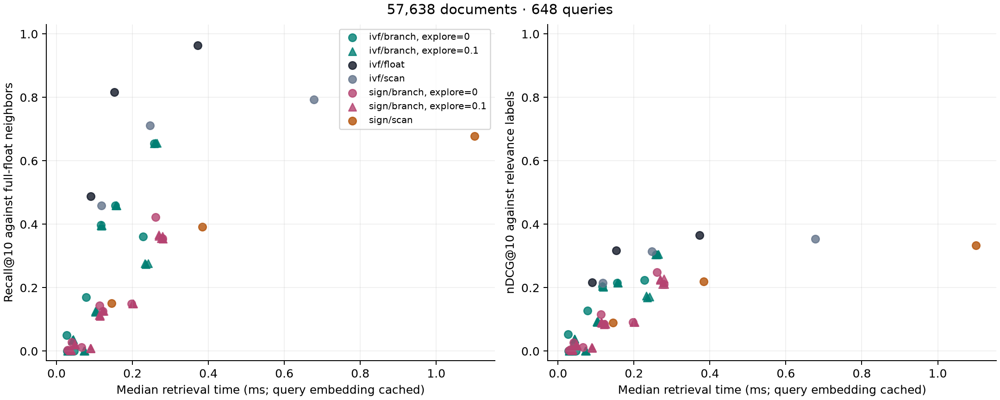

# FiQA run — 2026-09-09

**Timing caveat:** power mode was not held constant during this run. Its latency numbers are
retained as historical data. Use the [rerun comparison](../README.md) and
[current results](../fiqa-2026-09-09-clean/README.md) for the updated timings. Quality scores and
work counts were reproduced exactly in both later runs.

Full FiQA corpus: **57,638 documents and 648 test queries**. Nomic v1.5 provides 256-D vectors
for routing/binary search and 768-D vectors for the shared reranker. Search is single-threaded
on an Apple M5 Max. Query embeddings are already cached.

The sweep has 81 settings and 157,464 measured requests, including three timing repeats.
Probabilistic settings use three seeds; deterministic settings use one. Every method keeps
at most 100 candidates and returns up to ten results.

| Setting | Median retrieval ms | Full-float Recall@10 | nDCG@10 |
|---|---:|---:|---:|
| IVF binary scan, 1 probe | 0.118 | 0.459 | 0.215 |
| IVF branching, 1 probe, 512 nodes, explore 0 | 0.155 | 0.459 | 0.215 |
| IVF binary scan, 4 probes | 0.247 | 0.712 | 0.314 |
| IVF branching, 4 probes, 512 nodes, explore 0 | 0.258 | 0.655 | 0.304 |
| Faiss float IVF, 4 probes | 0.153 | 0.817 | 0.317 |

This run does not show a matched-quality advantage for branching over the scan. Small node
budgets are faster but can return very few candidates, especially when spread across many
buckets. Random exploration at 0.1 did not give a consistent improvement over deterministic
ordering. Sign routing used eight bits here; its 120 occupied buckets were quite uneven.

These are results for this encoder, corpus, implementation and machine. Faiss float IVF uses
a different candidate score; the controlled binary comparison is scan versus branching within
the same selected buckets.

- [All settings](report.md) and [summary CSV](summary.csv).
- [One query's branches](trace.md); [complete trace](trace.json).
- [Data, model, packages, source hashes and settings](metadata.json).
- `queries.csv.gz` contains all request measurements. It is compressed here; generated run
  directories keep the same table as `queries.csv`.
- `float_reference_rows.npy` contains the exact full-vector reference rows for these queries.

The default `experiment.toml` reproduces the settings. Timings will vary across runs and machines.
