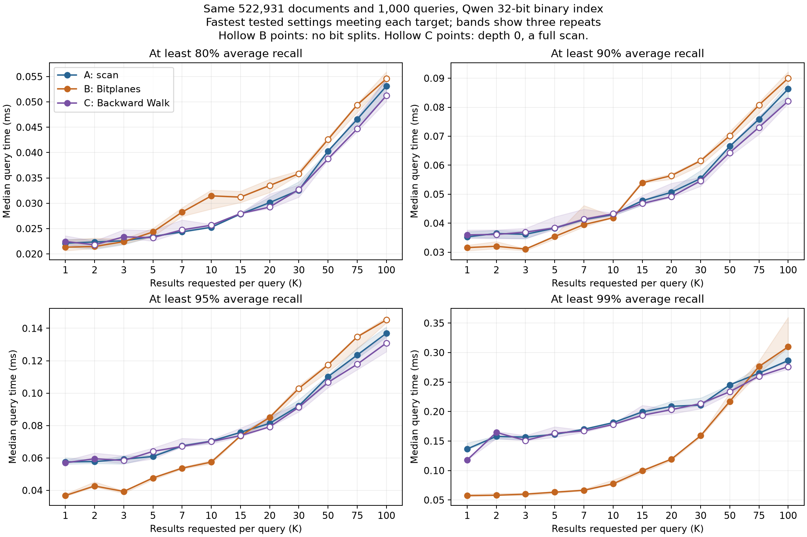
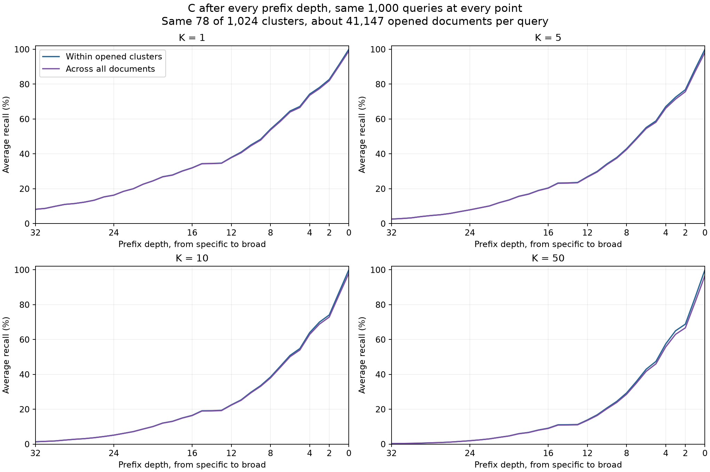
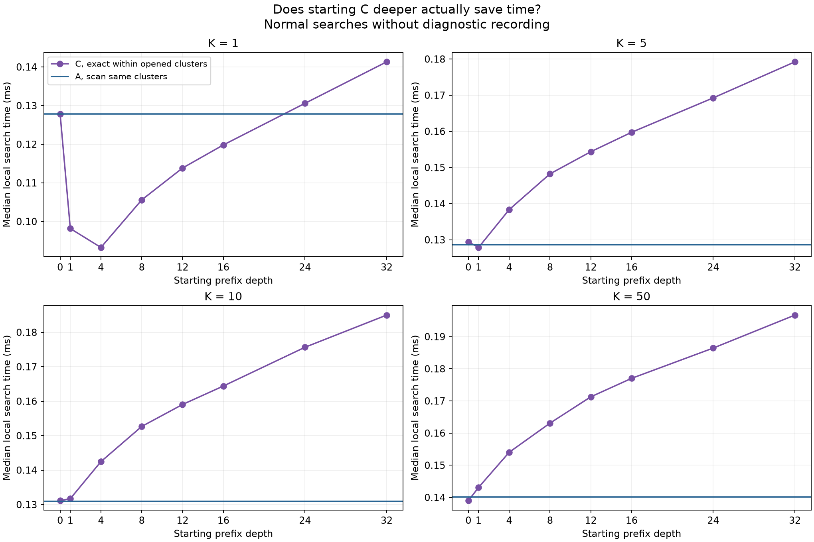

# K and prefix experiment results

Same Quora documents, queries and Qwen 32-bit binary score. These results are separate from the paper.

## What changed as K grew

Bitplanes still helps beyond K = 1. The useful range depends on the recall requirement and on whether we care about the median or slower queries.

I tried K = 1, 2, 3, 5, 7, 10, 15, 20, 30, 50, 75 and 100, using the same 522,931 documents and 1,000 queries. The clustering search covered 8 through 8,192 clusters, with the same choices available to all three methods. Each method could choose its own cluster count, probes and search settings. All settings had the same 64 GB process memory cap.

After selecting the configurations, I measured them together in three fresh timing blocks. I then repeated that shared round without changing the settings. The larger differences held up in both rounds; small differences should be treated cautiously.

| Required average recall | What the two shared rounds show for B versus A |
|---|---|
| 80% | Small K is close. A is generally faster from K = 7 onward. |
| 90% | B is ahead through K = 10, with a small advantage near 10. A is ahead from 15. |
| 95% | B is ahead through K = 15. K = 20 is close; A is ahead at 30 and above in the median comparisons. |
| 99% | B is ahead through K = 50. K = 75 is close, with A's median lower. A is clearly ahead at 100. |

These are ranges from the tested settings, not a universal crossover. The repeat ranges overlap at some points, including 99% / K = 75. The second round is saved in [timing-check.csv](timing-check.csv).



### Median time does not tell the whole story

At 99% required recall, B is about 2.5 times faster than A on the median at K = 5, and about 2.3 times faster at K = 10. At K = 50, its median advantage is smaller, and its average time is already slightly worse.

P95 is the time below which 95% of the measured queries finished. It shows that B can have slower difficult queries even while its median is better.

| K, at 99% required recall | A median / mean / P95, ms | B median / mean / P95, ms |
|---:|---:|---:|
| 1 | 0.1366 / 0.1412 / 0.1614 | 0.0575 / 0.0634 / 0.0938 |
| 5 | 0.1613 / 0.1631 / 0.1831 | 0.0633 / 0.0875 / 0.2122 |
| 10 | 0.1812 / 0.1819 / 0.2064 | 0.0775 / 0.1173 / 0.2847 |
| 50 | 0.2452 / 0.2436 / 0.2732 | 0.2172 / 0.2503 / 0.5590 |
| 100 | 0.2865 / 0.2964 / 0.3413 | 0.3097 / 0.3696 / 0.7925 |

These are the configurations selected for median latency. They are not separately optimized for P95. If the application mainly cares about slower queries, the preferred choice may change earlier.

### Why fewer document scores eventually stop helping

B still scores fewer documents at K = 100, but it also visits many bitmap words. One word stores 64 document flags. Visiting it is a bit operation over those flags, not 64 separate document scores, and the same word positions may be visited repeatedly in different branches.

| K, at 99% required recall | A documents scored | B documents scored | B words visited during splits | B words visited in leaf masks |
|---:|---:|---:|---:|---:|
| 1 | 24,181 | 818 | 53,693 | 5,838 |
| 5 | 29,270 | 1,544 | 65,767 | 11,494 |
| 10 | 32,613 | 2,199 | 77,802 | 16,570 |
| 50 | 43,158 | 5,461 | 145,007 | 41,705 |
| 100 | 50,865 | 7,842 | 191,417 | 60,026 |

These are averages per query. The word counts are work counters, not CPU instruction counts. They explain why counting only the avoided document scores is insufficient: B adds bitmap processing, memory access and branch management. At K = 100, its total measured time is higher despite scoring far fewer documents.

## What happened when C started deeper?

For this comparison, I fixed the same 78 selected clusters out of 1,024 for every method and every starting depth. They contain about 41,147 documents per query on average. The times in this section measure local search only, with routing already done.

C does not calculate recall during a live query. It scores the current prefix range, then checks whether it has K results and can prove that no unseen document in the opened clusters can beat them. If that check fails, it removes one prefix bit. Recall is calculated afterward against the exact reference.

### Broadening really does recover missing results

The table below evaluates the same 1,000 queries at each fixed depth. It is not an estimate from a normal distribution or from candidate count.

| Prefix bits kept | Mean documents scored | Global recall at K = 1 |
|---:|---:|---:|
| 32 | 0.137 | 8.2% |
| 16 | about 107 | 31.9% |
| 8 | about 1,770 | 53.7% |
| 4 | about 9,797 | 73.6% |
| 2 | about 15,684 | 82.0% |
| 1 | about 24,399 | 90.4% |
| 0 | about 41,147 | 99.0% |

The fractional document count at depth 32 is an average: most queries have no matching document at that exact prefix. At depth zero, C has searched every opened document. Global recall stops at 99% here because cluster selection missed some answers.



At K = 50, this fixed cluster selection reaches only 96.66% global recall even after scanning everything. The full comparison above allows different routing settings for that K. We cannot reach 99% inside these same 78 clusters merely by broadening the prefix further.

### But C also continues after finding the answer

At K = 1, 68.6% of queries scored additional documents after the exact local answer was already present. Across all queries, the mean was 15,693 additional scores. The bound was valid, but too loose to prove that those answers were already correct.

For example, query 55 found the correct local document after scoring four documents, at depth 21. Its score was 4.597932, while the unseen-score bound was still 4.673120, so C continued. It stopped at depth 2 after scoring 22,305 documents, when the bound had fallen to 4.582010. The result had not changed, but the implementation needed 22,301 more scores before its stopping rule allowed it to finish.

The benchmark can identify that first correct-result point afterward. A live search does not know it. Simply stopping at that point would require information the search does not have.

For larger K, the reason changes. At K = 50, 70.6% of queries needed the full opened set just to contain all of their exact local top-50 results. In those cases, the large range is not only a loose-bound issue. The required documents occupy prefixes that cannot all fit inside a more specific single prefix.

See [two measured query paths](depth/QUERY_EXAMPLES.md) for the scores, bounds and decisions at individual depths.

### Deeper starts saved some scores, but added more prefix work

| Starting depth, K = 1 | Mean scored documents | Mean boundary searches | Median local time |
|---:|---:|---:|---:|
| 4 | 26,153 | 495 | 0.0933 ms |
| 8 | 24,811 | 1,032 | 0.1056 ms |
| 16 | 24,517 | 2,137 | 0.1198 ms |
| 32 | 24,497 | 4,394 | 0.1413 ms |

Starting at 32 instead of 4 saved about 6.3% of the document scores, but took about 51.5% longer overall. The extra prefix work outweighed the saving in this setting.



There is a useful exception. For 82 of the 1,000 queries, C could stop at the full 32-bit prefix. Starting deeper was much faster for those queries. The other 918 queries paid for more lookups before reaching a broader range.

| Same query group, K = 1 | Start at 4 | Start at 32 |
|---|---:|---:|
| All 1,000 queries | 0.0933 ms | 0.1413 ms |
| 82 queries that stop at the full 32-bit prefix | 0.0497 ms | 0.0082 ms |
| Other 918 queries | 0.0985 ms | 0.1464 ms |

The groups use a search condition, not whether C won a timing comparison. The same two settings are used in every group. This shows a case where the deeper start helps, without treating that small group as the whole workload.

### What about approximate stopping?

I also tried stopping after a document count target, using K, 4K, 16K and 64K, plus targets of 1,000 and 10,000 in the refinements. These configurations were judged by their measured recall, not assumed to meet a target because they returned enough candidates. The count is checked after a full depth, so actual scoring can exceed it.

None of the selected C settings used that approximate stop. Of the 48 selected C points in the primary comparison, 41 start at depth zero and perform a full scan, six start at depth 1, and one starts at depth 4. The depth-4 point is K = 1 at 99% recall. Thus, the small timing advantages of C's scan fallback should not be described as wins from prefix pruning.

## The 256-bit check

The targeted 256-bit comparison uses the same document and query IDs, but its own exact 256-bit binary reference. It tests K = 1, 5, 10 and 50 with 64, 1,024 and 4,096 clusters. This is a smaller follow-up, not the full 32-bit parameter search repeated at every width.

| K, at 99% required recall | A | B | C |
|---:|---:|---:|---:|
| 1 | 0.2378 ms | 0.2443 ms | 0.2377 ms |
| 5 | 0.8879 ms | 0.9214 ms | 0.8836 ms |
| 10 | 1.1378 ms | 1.1632 ms | 1.1189 ms |
| 50 | 1.8661 ms | 1.9387 ms | 1.8397 ms |

The selected B settings perform no bitplane splits, and the selected C settings start at depth zero. This check did not establish a pruning benefit at 256 bits. The positive 32-bit result therefore should not be presented as a general result for larger representations.

## Branch probability

At K = 1, 5, 10 and 50, I compared probabilities 0 and 0.1 at the selected B budgets, keeping seeds 7, 42 and 123. All versions recovered exactly the same number of reference results for each K. Probability 0.1 did not give a consistent timing improvement. The individual seed results are kept in [the probability summary](probability/summary.csv); no best seed was selected.

## Checks and interpretation

The machine is an Apple M5 Max with 128 GiB physical memory. Search uses one CPU thread. Encoding, loading, index construction and reference calculation are outside the query timer. The main comparisons include routing; the fixed-cluster C diagnosis excludes it.

All 144 final points meet their recall requirements. The additional shared timing round reproduced every recall and every recorded work count. Absolute timings varied over the long session, so the tables compare methods within the same timing round, and small differences remain uncertain. Both rounds used the same recorded AC power configuration.

The independent audit reran all 144 selected settings on all 1,000 queries. Returned IDs reproduced each query's recorded recall, and returned scores matched a separate NumPy calculation. The input hashes remained unchanged. The full test suite passed 406 tests. The selected 32-bit workers peaked at about 81 MiB, including runtime and index construction, well below the common cap. Memory pressure did not determine these results.

These are measured recalls against the exact binary ranking, not human relevance or full-embedding recall. The same queries were used to explore the settings and compare them, so the conclusions apply to this query set. The search found the best tested settings, not a proof of the best possible settings for every dataset or machine.

## Suggested paper changes

The paper has not been edited by this experiment. I would keep Section 1, the method definitions and the existing scoring equations. In the experiment section, I would add the K comparison, distinguish median time from slower-query time, and replace the vague prefix-broadening explanation with the measured depth and stopping examples above.

A short replacement passage could be:

> Increasing K does not remove Bitplanes' advantage immediately. At the 99% recall requirement, its median remains lower through K = 50 in both timing rounds, although the advantage is smaller at 50 and its slower-query times are worse. At lower recall requirements, scanning becomes competitive much earlier. The useful range therefore depends on both K and the required recall.

For C:

> Starting Backward Walk deeper does reduce the initial range, but the final cost depends on where the search can stop. At K = 1, starting at depth 32 reduces the mean scored count from 26,153 to 24,497 compared with starting at 4, while increasing boundary searches from 495 to 4,394. It is much faster for the 82 queries that can stop at the full prefix, but slower across the complete query set. The depth traces also show that C often finds the correct answer before its score bound allows it to stop. That gives a specific direction for improvement, rather than assuming that a longer starting prefix is sufficient.

Two follow-ups are supported by the recorded work: improve the bound's usefulness, and avoid redundant prefix lookups. In particular, dropping one bit leaves one range boundary unchanged, while the current implementation searches for both boundaries again. Neither optimization was implemented or credited with a speedup in these results.

## Complete target tables

The tables below use the first final shared timing round. The second is in [timing-check.csv](timing-check.csv). Hollow points in the chart indicate B settings without bit splits or C settings starting at depth zero.

## Required average recall: 80%

Each cell is median ms / achieved recall. Times include routing. Selected configurations were repeated three times.

| K | A: scan | B: Bitplanes | C: Backward Walk |
|---:|---:|---:|---:|
| 1 | 0.0221 / 80.30% | 0.0213 / 81.90% | 0.0225 / 80.30% |
| 2 | 0.0224 / 80.00% | 0.0215 / 81.40% | 0.0218 / 80.00% |
| 3 | 0.0226 / 80.50% | 0.0224 / 80.57% | 0.0234 / 80.50% |
| 5 | 0.0234 / 80.20% | 0.0243 / 80.30% | 0.0232 / 80.20% |
| 7 | 0.0244 / 80.27% | 0.0282 / 81.70% | 0.0247 / 80.27% |
| 10 | 0.0253 / 80.10% | 0.0315 / 80.89% | 0.0257 / 80.10% |
| 15 | 0.0279 / 80.05% | 0.0312 / 80.05% | 0.0280 / 80.05% |
| 20 | 0.0301 / 80.44% | 0.0335 / 80.44% | 0.0293 / 80.44% |
| 30 | 0.0326 / 80.15% | 0.0358 / 80.15% | 0.0327 / 80.15% |
| 50 | 0.0403 / 80.31% | 0.0426 / 80.31% | 0.0387 / 80.31% |
| 75 | 0.0466 / 80.23% | 0.0494 / 80.23% | 0.0447 / 80.23% |
| 100 | 0.0531 / 80.11% | 0.0546 / 80.11% | 0.0512 / 80.11% |

## Required average recall: 90%

Each cell is median ms / achieved recall. Times include routing. Selected configurations were repeated three times.

| K | A: scan | B: Bitplanes | C: Backward Walk |
|---:|---:|---:|---:|
| 1 | 0.0353 / 90.10% | 0.0316 / 91.30% | 0.0360 / 90.10% |
| 2 | 0.0365 / 90.25% | 0.0320 / 90.90% | 0.0361 / 90.25% |
| 3 | 0.0362 / 90.00% | 0.0311 / 90.03% | 0.0369 / 90.00% |
| 5 | 0.0383 / 90.10% | 0.0354 / 90.78% | 0.0384 / 90.10% |
| 7 | 0.0412 / 90.09% | 0.0395 / 90.80% | 0.0414 / 90.09% |
| 10 | 0.0430 / 90.09% | 0.0419 / 90.12% | 0.0432 / 90.09% |
| 15 | 0.0477 / 90.13% | 0.0540 / 90.60% | 0.0468 / 90.13% |
| 20 | 0.0507 / 90.05% | 0.0564 / 90.05% | 0.0492 / 90.05% |
| 30 | 0.0554 / 90.13% | 0.0615 / 90.13% | 0.0546 / 90.13% |
| 50 | 0.0665 / 90.09% | 0.0702 / 90.09% | 0.0643 / 90.09% |
| 75 | 0.0759 / 90.17% | 0.0808 / 90.17% | 0.0731 / 90.17% |
| 100 | 0.0863 / 90.09% | 0.0900 / 90.09% | 0.0821 / 90.09% |

## Required average recall: 95%

Each cell is median ms / achieved recall. Times include routing. Selected configurations were repeated three times.

| K | A: scan | B: Bitplanes | C: Backward Walk |
|---:|---:|---:|---:|
| 1 | 0.0576 / 95.00% | 0.0368 / 95.30% | 0.0570 / 95.00% |
| 2 | 0.0578 / 95.00% | 0.0427 / 96.60% | 0.0595 / 95.00% |
| 3 | 0.0592 / 95.00% | 0.0393 / 95.17% | 0.0585 / 95.00% |
| 5 | 0.0609 / 95.02% | 0.0476 / 96.72% | 0.0640 / 95.02% |
| 7 | 0.0674 / 95.07% | 0.0537 / 95.40% | 0.0672 / 95.07% |
| 10 | 0.0704 / 95.00% | 0.0575 / 95.03% | 0.0702 / 95.00% |
| 15 | 0.0758 / 95.01% | 0.0736 / 95.77% | 0.0737 / 95.01% |
| 20 | 0.0814 / 95.02% | 0.0850 / 95.21% | 0.0792 / 95.02% |
| 30 | 0.0921 / 95.03% | 0.1029 / 95.03% | 0.0913 / 95.03% |
| 50 | 0.1101 / 95.04% | 0.1174 / 95.04% | 0.1066 / 95.04% |
| 75 | 0.1235 / 95.01% | 0.1347 / 95.01% | 0.1178 / 95.01% |
| 100 | 0.1370 / 95.03% | 0.1452 / 95.03% | 0.1309 / 95.03% |

## Required average recall: 99%

Each cell is median ms / achieved recall. Times include routing. Selected configurations were repeated three times.

| K | A: scan | B: Bitplanes | C: Backward Walk |
|---:|---:|---:|---:|
| 1 | 0.1366 / 99.00% | 0.0575 / 99.20% | 0.1180 / 99.00% |
| 2 | 0.1579 / 99.00% | 0.0581 / 99.30% | 0.1646 / 99.00% |
| 3 | 0.1565 / 99.00% | 0.0600 / 99.13% | 0.1510 / 99.00% |
| 5 | 0.1613 / 99.00% | 0.0633 / 99.20% | 0.1633 / 99.00% |
| 7 | 0.1700 / 99.00% | 0.0665 / 99.10% | 0.1671 / 99.00% |
| 10 | 0.1812 / 99.00% | 0.0775 / 99.13% | 0.1781 / 99.00% |
| 15 | 0.1993 / 99.00% | 0.0995 / 99.12% | 0.1935 / 99.00% |
| 20 | 0.2088 / 99.00% | 0.1193 / 99.05% | 0.2033 / 99.00% |
| 30 | 0.2110 / 99.00% | 0.1590 / 99.40% | 0.2135 / 99.00% |
| 50 | 0.2452 / 99.00% | 0.2172 / 99.33% | 0.2336 / 99.00% |
| 75 | 0.2651 / 99.00% | 0.2764 / 99.27% | 0.2600 / 99.00% |
| 100 | 0.2865 / 99.00% | 0.3097 / 99.21% | 0.2761 / 99.00% |

## Files

- `comparison.json`: selected parameters, achieved recall, times, repeat spread and memory.
- `k-latency.png`: the K comparison.
- `depth/`: same-cluster traces, normal local timings and plots.
- [timing-check.csv](timing-check.csv): second shared timing round with identical settings.
- [audit.json](audit.json): returned-ID, score and input checks.
- [run-counts.csv](run-counts.csv): completed settings and query counts for each phase.
- [K sweep driver](../../experiments/k_prefix_study.py) and [configurations](../../experiments/configs/).
- [Prefix depth experiment](../../experiments/prefix_depth_study.py).
- [Final shared timing round](../../experiments/k_prefix_final.py) and [independent audit](../../experiments/k_prefix_audit.py).
- [C++ prefix search](../../cpp/prefix_index_v2.cpp) and [prefix tests](../../tests/test_prefix_index_v2.py).

A small difference between overlapping timing repeats is not a clear win. A short-code binary recall result is not a claim about full-embedding or human relevance quality.


## Compressed query logs

The three `depth/timing-prefix-*/queries.jsonl` logs exceed GitHub's per-file limit.
Their `.jsonl.gz` copies contain the same records without any rounding or filtering.
To restore the original filenames after cloning:

```sh
gzip -dk results/k-prefix-study-2026-09-13/depth/timing-prefix-*/queries.jsonl.gz
```

The decompressed SHA-256 values are:

| Log | SHA-256 |
|---|---|
| `depth/timing-prefix-0/queries.jsonl` | `c1a9fd541c8bb4b25a83d0c2291ee6327d4dd00cb7cde902885edc16e33fd8a1` |
| `depth/timing-prefix-1/queries.jsonl` | `17e14196538132670ce33b47888c639e1f9782a7a5237c96f8ca46119acdd0e4` |
| `depth/timing-prefix-2/queries.jsonl` | `d22955b121243309a37b65c49f7a66fe7a9ae8cf8a1b68215f85c49ade41f076` |
