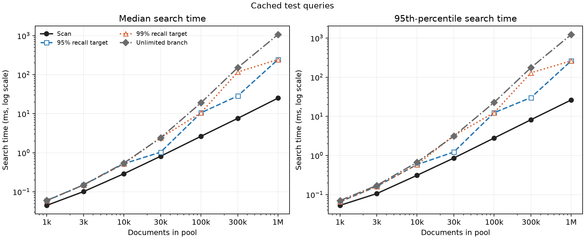
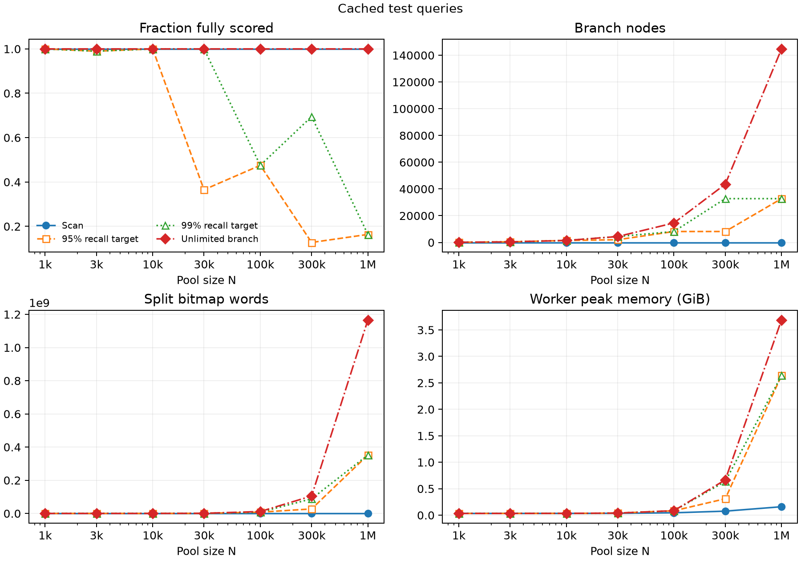

# Scan versus bitplanes: one million passages

**No latency crossover was found.** Scan was faster at every tested pool size, for both the 95% and 99% candidate-recall targets. At one million documents, scan took **25.14 ms** median; the selected bitplane setting took **244.98 ms** with **99.26% recall**. That is about **9.75 times as long**.

This result describes the current implementation and settings on an Apple M5 Max with 128 GiB RAM. It does not establish a result for every possible bitplane layout.

## What was tested

The question was whether larger document pools would make branching more useful. We removed routing, used one fixed sample of real MS MARCO passages, and compared the existing packed scan with the existing branching code. Both methods used exactly the same input arrays and weighted binary score.

| Parameter | Values in this run |
|---|---|
| Documents in the pool | 1k, 3k, 10k, 30k, 100k, 300k, 1M |
| Node budget | 32, 128, 512, 2048, 8192, 32768, 65536, 131072, 262144, unlimited |
| Document representation | Fixed: 256 sign bits from Nomic v1.5 |
| Leaf size | Fixed: 32 documents |
| Exploration probability | Fixed: 0 |
| Candidates | Fixed: 100 |
| Threads and query batch | One CPU thread, one query per call |

**This is a document-count and budget study. Probability, width and leaf-size sweeps have not been run here.** The full 768-D vectors are cached so other widths can be prepared without encoding the corpus again.

## Validation and test queries

We used 100 tuning/validation queries to choose the fastest tested budget reaching each recall target, then 200 separate test queries to measure those choices. No model was trained. Internal files call these groups `development` and `evaluation`. Both groups were drawn from the provider’s dev-small queries; this is our study split, not an official MS MARCO test-set submission.

The choices were committed in `f84ccce` before evaluation. Every setting has three timing repetitions. Recall counts unique queries; repetitions are not extra independent quality examples.

## Held-out results

| Documents | Scan median, ms | 95% target median, ms | Achieved recall | 99% target median, ms | Achieved recall |
|---:|---:|---:|---:|---:|---:|
| 1,000 | 0.045 | 0.059 | 100.00% | 0.059 | 100.00% |
| 3,000 | 0.101 | 0.149 | 99.97% | 0.149 | 99.97% |
| 10,000 | 0.289 | 0.522 | 100.00% | 0.522 | 100.00% |
| 30,000 | 0.812 | 1.032 | 96.17% | 2.415 | 100.00% |
| 100,000 | 2.630 | 10.514 | 99.37% | 10.514 | 99.37% |
| 300,000 | 7.602 | 28.545 | 96.09% | 117.026 | 100.00% |
| 1,000,000 | 25.136 | 244.985 | 99.26% | 244.985 | 99.26% |

All 14 target points met their test recall target. Scan also had lower p95 latency at every pool size. The chosen budget is the fastest among the tested settings, not a global optimum.



The time axis uses a log scale so values from hundredths of a millisecond to over a second remain visible. The [speedup graph](analysis/speedup.png) shows the same comparison as a ratio: below 1 means branching was slower.

## Why less document scoring was still slower

At one million documents, the selected branch setting fully scored about **163,766 documents**. It saved roughly 84% of full document scoring. But each active bitmap still had **15,625 64-bit words**, even after most positions became empty.

| Work per query | Scan | Selected branching |
|---|---:|---:|
| Documents fully scored | 1,000,000 | 163,766 on average |
| Four-bit score-table terms | 64 million | 10.48 million |
| Nodes visited | 0 | 32,768 |
| Word visits while splitting | 0 | 352.47 million |

The scan uses four bits per table lookup: `1,000,000 × (256 / 4) = 64,000,000` terms. Branching uses the same scorer for survivors, plus the bitmap work. Every split word needs two AND filters, a bit count, and writes to child masks. Queue operations and allocations add more work.

Leaf processing also walks a full-width active bitmap. With this implementation, `32,768 nodes × 15,625 words = 512 million` bitmap-loop iterations in total; about 160 million are leaf-loop checks. This total is derived from the unchanged code and recorded node count. The recorded `bitplane_words` counter measures splitting only. These work counts are not equal-cost CPU instructions.

Unlimited branching fully scored **999,960.5 documents on average** and took **1,068.84 ms** median at 1M. It did almost all the scoring plus traversal.



Worker peak memory includes Python, input arrays, index storage and temporary search buffers. The worker’s own peak is used in this figure because periodic samples missed brief peaks in small cases. Both readings remain in the tables.

## Options for the next experiment

The query-sign and magnitude rule can stay. A global index does not require every pending branch to keep a full-width bitmap.

| Option | What to test | Tradeoff |
|---|---|---|
| Larger leaves | Score groups earlier, for example at 128 or 512 documents | More scoring, fewer splits; already configurable |
| Remaining document IDs | Keep just the surviving IDs and check their next bit | Simple; loses the wide bit operations for large groups |
| Sparse bitmap words | Keep only `(word position, active bits)` entries that are nonzero | Preserves the branching rule while shrinking later work |
| Dense then sparse | Switch representations after the active set gets small | Could help both ends, but adds a decision to tune |
| IVF plus scan | Compare the existing clustered baseline separately | Reduces the searched pool, with possible missed-cluster errors |

**The next data-structure candidate is sparse active words.** Start by requiring identical candidate rows at the same query and budget, then compare time and memory. This changes the representation without changing the direction rule. A larger-leaf sweep is the cheapest separate parameter check.

Exploration probability is a different control: it changes which pending branch is visited next. Probability 0 still explores alternatives in best-possible-score order. A value of 0.1 sometimes chooses a random pending alternative. The budget controls how much branching work is allowed. A probability sweep should hold document count and budget fixed so that effect is clear.

## Files and reproduction

- [Full report and tables](analysis/report.md), [all settings](analysis/settings.csv), [target points](analysis/target-points.csv), [budget curves](analysis/budgets.png).
- [Raw-result validation](validation.json): 316 complete cases, 39,045 saved query rows, 14,730 exact ordered-candidate checks, and independently recomputed summary percentiles.
- [Frozen choices](selections.json) and [selection checkpoint](selection-checkpoint.md).
- [Preparation](preparation/README.md), [pilot](pilot/README.md), [hardware](host.json), and [protocol](protocol.md).
- `cases/` and `schedules/` preserve the raw measurements and execution order. Query records are gzip-compressed; [archive checksums](archive-checksums.json) verify their original bytes.
- `inputs/` preserves selected document IDs, source positions, labels and selection metadata. Passage texts, weights and full vectors stay outside Git.

Regenerate the report from these saved files, without downloading the corpus or running the encoder:

```bash
.venv/bin/python scaling.py --stage report --run-dir results/scaling-msmarco-1m
```

Recall here is recovery of the exact binary scorer’s best candidates. Human relevance labels are a separate evaluation. This random 1M subset is not the official full-corpus leaderboard benchmark.
